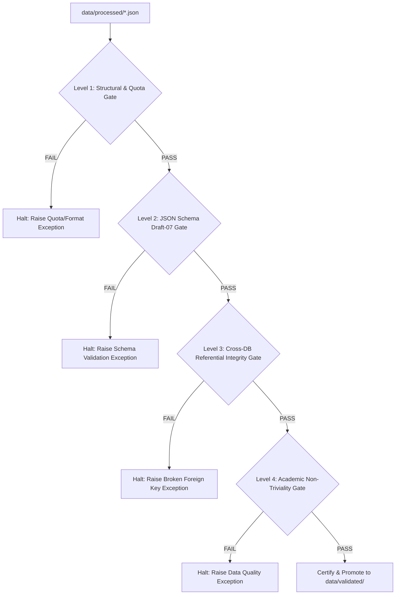
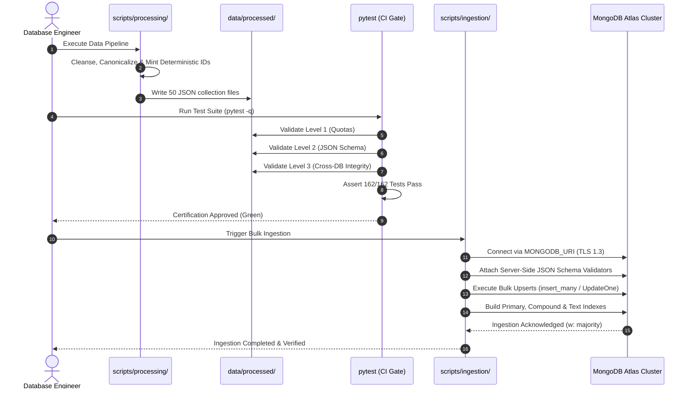

# End-to-End Data Flow & Validation Pipeline Specification

> **Course**: Advanced Database Management Systems (ADBMS)  
> **System**: GRAMMY Awards Information & Analytics System  
> **Phase**: Phase 5 — System Architecture  
> **Document**: Comprehensive Ingestion Lifecycle, Multi-Tier Validation Flow & Research-to-MongoDB Pipeline  
> **Status**: Completed  
> **Lead Architect**: Database Architecture & Engineering Team  
> **Repository**: [GitHub Repository](https://github.com/bharathwajverse/music-grammy-awards-db.git)  

---

## 1. Executive Summary & Pipeline Overview

The **GRAMMY Awards Information & Analytics System** utilizes a unidirectional, multi-stage data processing pipeline. This pipeline guarantees that every BSON document stored in the five MongoDB Atlas databases originates from legitimate, verified sources, satisfies strict structural schema constraints, and preserves cross-database referential integrity without manual intervention.

```
┌────────────────────────────────────────────────────────────────────────────────────────┐
│                        RESEARCH-TO-MONGODB END-TO-END PIPELINE                         │
├───────────────┬─────────────────┬─────────────────┬──────────────────┬─────────────────┤
│    STAGE 1    │     STAGE 2     │     STAGE 3     │     STAGE 4      │     STAGE 5     │
│   Discovery   │   Raw Staging   │ Processing & ID │ Pre-Flight Multi-│ MongoDB Atlas   │
│  & Licensing  │                 │ Canonicalization│ Tier Validation  │ Bulk Ingestion  │
├───────────────┼─────────────────┼─────────────────┼──────────────────┼─────────────────┤
│ • Source Reg  │ • data/raw/     │ • scripts/      │ • Level 1-4 Gate │ • Atlas Cluster │
│ • Lic Audit   │ • CSV/JSON/API  │ • Slug / Regex  │ • JSON Schema    │ • PyMongo Bulk  │
│ • Provenance  │ • Immutable     │ • Cross-Linking │ • Integrity Pass │ • 5 Databases   │
└───────────────┴─────────────────┴─────────────────┴──────────────────┴─────────────────┘
```

---

## 2. End-to-End Data Flow Architecture

The data lifecycle transitions across seven discrete storage and processing tiers:

```mermaid
flowchart TD
    subgraph Sources["External Sources (Phase 2 & 3 Approved)"]
        S1["SRC-01: Official Recording Academy Archives"]
        S2["SRC-02: MusicBrainz Open Music DB"]
        S3["SRC-03: Library of Congress National Recording Registry"]
        S4["SRC-04: Wikidata Knowledge Graph"]
        S5["SRC-05 & 07: Verified Kaggle Historical Archives"]
    end

    subgraph RawStaging["Tier 1: Raw Data Staging (data/raw/)"]
        R1["raw_ceremonies.csv"]
        R2["raw_nominations_full.json"]
        R3["raw_creators_catalog.json"]
        R4["raw_categories_taxonomy.csv"]
    end

    subgraph Processing["Tier 2: Processing & Canonicalization (scripts/processing/)"]
        P1["Data Cleaning & Type Coercion"]
        P2["Deterministic Identifier Minting"]
        P3["Cross-Entity Entity Resolution"]
        P4["Domain Partitioning into 5 Namespaces"]
    end

    subgraph ProcessedData["Tier 3: Processed Datasets (data/processed/)"]
        D1["grammy_history_db/*.json (10 files)"]
        D2["grammy_categories_db/*.json (10 files)"]
        D3["grammy_nominations_db/*.json (10 files)"]
        D4["grammy_winners_db/*.json (10 files)"]
        D5["grammy_creators_db/*.json (10 files)"]
    end

    subgraph ValidationEngine["Tier 4: Automated Pre-Flight Validation Engine"]
        V1["Level 1: Structural & Quota Check (>=50 docs, >=10 fields)"]
        V2["Level 2: JSON Schema Draft-07 Conformance"]
        V3["Level 3: Cross-Database Referential Integrity Assertions"]
        V4["Level 4: Academic Quality & Non-Triviality Assertions"]
    end

    subgraph ValidatedStorage["Tier 5: Validated Staging (data/validated/)"]
        VAL["Certified Golden Datasets Ready for Ingest"]
    end

    subgraph Ingestion["Tier 6: Database Ingestion Engine (scripts/ingestion/)"]
        ING["PyMongo Bulk Write with Upsert Logic (w: majority)"]
    end

    subgraph AtlasCluster["Tier 7: MongoDB Atlas Production Cluster"]
        A1[("grammy_history_db")]
        A2[("grammy_categories_db")]
        A3[("grammy_nominations_db")]
        A4[("grammy_winners_db")]
        A5[("grammy_creators_db")]
    end

    Sources --> RawStaging
    RawStaging --> Processing
    Processing --> ProcessedData
    ProcessedData --> ValidationEngine
    ValidationEngine -- PASS --> ValidatedStorage
    ValidationEngine -- FAIL --> Quarantine["Quarantine Log & Alert"]
    ValidatedStorage --> Ingestion
    Ingestion --> AtlasCluster
```



---

## 3. Detailed Ingestion Pipeline Stages

### Stage 1: Source Discovery, Licensing Verification & Provenance Tagging
- **Input**: External archives, historical almanacs, MusicBrainz APIs, and verified Kaggle packages.
- **Rules**:
  - Every external file must be recorded in `sources/source-register.csv`.
  - Must have an approved licensing determination (`APPROVED` or `APPROVED_WITH_ATTRIBUTION`) documented in `sources/licensing-report.md`.
  - Quarantined datasets (such as `reisanar/datasets/grammyDB.csv` marked `NEEDS_REVIEW`) are prohibited from entering raw staging.
- **Output**: Audited raw files ready for staging.

### Stage 2: Raw Staging (`data/raw/`)
- **Input**: Raw dumps directly downloaded or exported from verified sources.
- **Invariants**:
  - Raw files are strictly immutable; no manual editing of files in `data/raw/`.
  - Preserved in original format (CSV, JSON, XML) to serve as an immutable historical audit trail.
- **Output**: Frozen source dumps tagged with intake timestamps.

### Stage 3: Cleansing, Normalization & Canonicalization (`scripts/processing/`)
- **Input**: Files in `data/raw/`.
- **Operations**:
  1. **String Normalization**: Unicode NFKD stripping, whitespace trimming, casing harmonization (e.g., "The Beatles" vs "Beatles, The").
  2. **Type Coercion**: Converting string timestamps to ISO-8601 strings (`YYYY-MM-DDTHH:MM:SSZ`), parsing integer counts (ratings, seating capacities, durations), and normalizing currency values to standard numerical floats.
  3. **Deterministic Identifier Generation**: Generating standardized primary keys according to global regular expressions:
     - `ceremony_id` $\rightarrow$ `CEREMONY_001` through `CEREMONY_067`.
     - `category_id` $\rightarrow$ `CAT_` + uppercase slugified name (e.g., `CAT_ALBUM_OF_THE_YEAR`).
     - `work_id` $\rightarrow$ `WRK_` + slugified title + release year (e.g., `WRK_RENAISSANCE_2022`).
     - `nomination_id` $\rightarrow$ `NOM_{CEREMONY}_{CAT}_{SEQ}` (e.g., `NOM_065_AOTY_01`).
     - `creator_id` $\rightarrow$ `CRT_` + slugified artist name (e.g., `CRT_BEYONCE_KNOWLES`).
  4. **Domain Partitioning**: Segregating raw composite tables into the five designated database namespaces.
- **Output**: 50 discrete JSON collection files written to `data/processed/<db_name>/<collection>.json`.

### Stage 4: Pre-Flight Multi-Tier Validation Engine
- **Input**: Processed JSON datasets in `data/processed/`.
- **Operations**: Executes automated test gates across structural, schema, integrity, and domain dimensions.
- **Output**: Test report certification; certified datasets copied to `data/validated/`.

### Stage 5: MongoDB Atlas Bulk Ingestion (`scripts/ingestion/`)
- **Input**: Validated datasets from `data/validated/`.
- **Operations**:
  1. Establish authenticated connection to MongoDB Atlas using `MONGODB_URI` environment variable.
  2. Apply collection-level JSON Schema validators to enforce server-side validation rules.
  3. Perform bulk batch upserts using `pymol.UpdateOne({"_id": doc_id}, {"$set": doc}, upsert=True)`.
  4. Build required unique, compound, and multikey B-tree indexes.
  5. Verify post-ingestion document counts against processed manifests.
- **Output**: 5 live, populated MongoDB databases on MongoDB Atlas.

---

## 4. Multi-Tier Validation Flow Specification

Validation is structured into four sequential gates. A failure at any gate halts the pipeline immediately and writes the rejected payload to an error log.



### 4.1. Level 1: Structural & Quota Validation Gate
- **Tool**: Python native file inspection (`tests/test_quotas_and_counts.py`).
- **Assertions**:
  1. *Collection Count*: Each of the 5 database directories must contain $\ge 10$ collection JSON files (Total $\ge 50$ collections).
  2. *Document Volume Quota*: Every collection file must contain a top-level JSON array with $\ge 50$ legitimate documents.
  3. *Field Count Quota*: Every document must contain $\ge 10$ meaningful domain attributes (excluding empty or null padding).

### 4.2. Level 2: JSON Schema Draft-07 Conformance Gate
- **Tool**: `jsonschema.Draft7Validator` (`tests/test_schema_validity.py` & `tests/test_dataset_validation.py`).
- **Assertions**:
  1. *Schema Existence*: Every collection must have a matching formal schema in `schemas/json_schemas/<db_name>/<collection>.json`.
  2. *BSON Type Checking*: Field types strictly conform to schema definitions (`string`, `integer`, `number`, `boolean`, `array`, `object`).
  3. *Regex Identifier Enforcement*: Primary keys and foreign keys match mandatory regex patterns (e.g., `^NOM_[0-9]{3}_[A-Z0-9_]+_[0-9]{2}$`).
  4. *Enumeration Restrictions*: Fields with restricted domain vocabularies (e.g., `venue_type`, `award_tier`, `trophy_status`) match declared enum arrays.
  5. *Required Fields*: All 10+ declared required fields are present in 100% of documents.

### 4.3. Level 3: Cross-Database Referential Integrity Gate
- **Tool**: Custom Referential Graph Validator (`tests/test_dataset_validation.py::test_cross_database_referential_integrity`).
- **Assertions**:
  1. **Nomination to Ceremony**: Every `nomination_entries.ceremony_id` resolves to an existing record in `grammy_history_db.ceremonies.ceremony_id`.
  2. **Winner to Nomination**: Every `winner_records.nomination_id` resolves to an existing record in `grammy_nominations_db.nomination_entries.nomination_id`.
  3. **Credit to Creator**: Every `nomination_credits.creator_id` resolves to an existing entity in `grammy_creators_db.{artists, producers, audio_engineers, songwriters_composers, arrangers_conductors}`.
  4. **Work to Label**: Every `nominated_works.record_label_id` resolves to an existing entity in `grammy_creators_db.record_labels.label_id`.
  5. **Speech to Winner**: Every `acceptance_speeches.nomination_id` resolves to an existing record in `grammy_winners_db.winner_records.nomination_id`.

### 4.4. Level 4: Academic Non-Triviality & Domain Authenticity Gate
- **Tool**: Domain Quorum Assertion Scripts (`scripts/validation/verify_academic_integrity.py`).
- **Assertions**:
  1. *No Synthetic Filler*: Documents must not contain placeholder strings (e.g., "TBD", "Lorem Ipsum", "dummy_artist", "placeholder_work").
  2. *Realistic Historical Values*: Runtimes must be positive integers; Nielsen ratings must fall between $0.0$ and $50.0$; release dates must fall within valid historical epochs ($1958$ to present).
  3. *Uniqueness Guarantee*: No duplicate primary keys within any collection file.

---

## 5. Research-to-MongoDB Pipeline Implementation



### 5.1. Idempotency & Replayability Protocol
The ingestion engine is engineered to be **100% idempotent**:
- Every record uses its deterministic domain key as the MongoDB `_id` field.
- Ingestion executes using `UpdateOne({"_id": doc_id}, {"$set": doc}, upsert=True)`.
- If a pipeline job crashes halfway through, it can be re-run immediately without producing duplicate documents, corrupted indices, or partial state drift.

### 5.2. Error Handling & Quarantine Protocol
When a raw input row fails validation during processing:
1. The record is ejected from the processing stream.
2. An error entry is appended to `data/quarantine/rejected_records.jsonl` with:
   - `timestamp`: ISO-8601 UTC timestamp.
   - `source_file`: Originating raw file path.
   - `raw_record`: Exact verbatim input row.
   - `failure_reason`: Specific schema or validation error message.
3. The processing pipeline continues for valid rows, ensuring batch resilience while alerting engineers to missing mappings.
