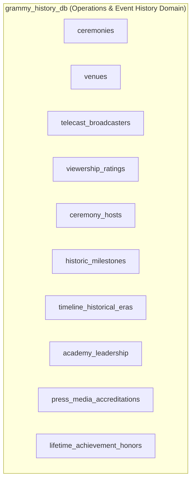
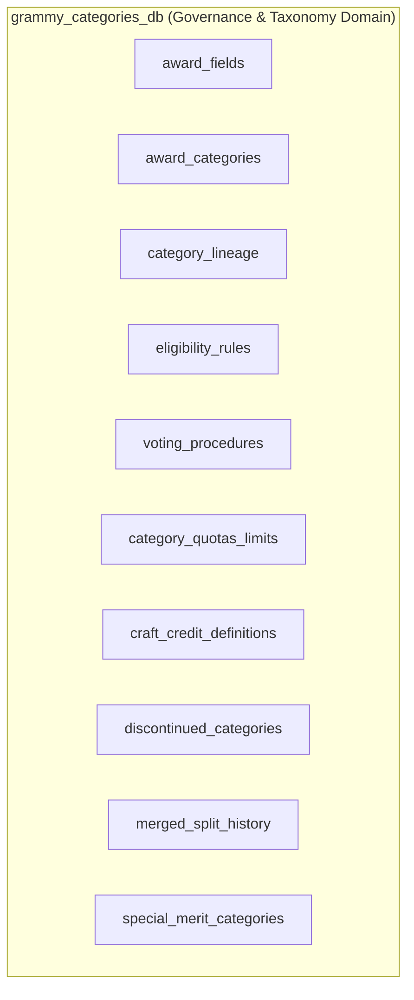
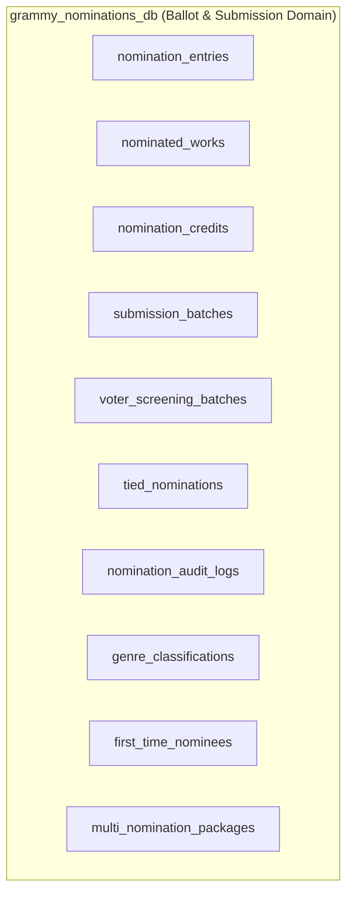
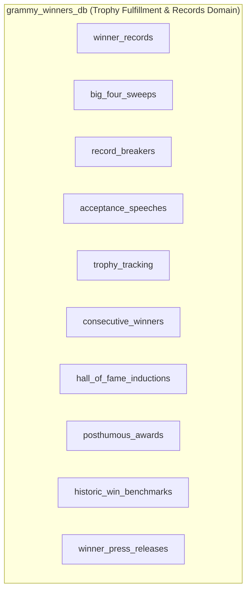
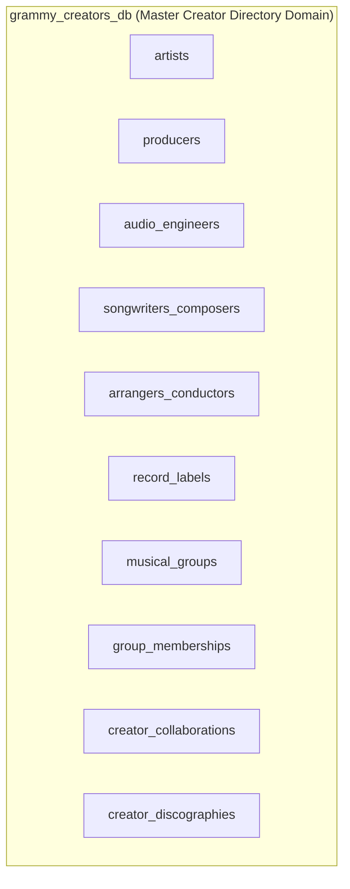

# Database Boundaries & Domain Encapsulation Specification

> **Course**: Advanced Database Management Systems (ADBMS)  
> **System**: GRAMMY Awards Information & Analytics System  
> **Phase**: Phase 5 — System Architecture  
> **Document**: Multi-Database Boundaries, Domain Encapsulation, Prohibited Entities & Cross-Boundary Governance  
> **Status**: Completed  
> **Lead Architect**: Database Architecture & Engineering Team  
> **Repository**: [GitHub Repository](https://github.com/bharathwajverse/music-grammy-awards-db.git)  

---

## 1. Architectural Boundary Philosophy

The **GRAMMY Awards Information & Analytics System** avoids monolithic database designs by partitioning its data architecture across **five discrete MongoDB databases**. Each database encapsulates a distinct business domain aligned with Domain-Driven Design (DDD) bounded context principles:

```
┌────────────────────────────────────────────────────────────────────────────────────────┐
│                             FIVE-DATABASE BOUNDED CONTEXT MAP                         │
├─────────────────────────┬─────────────────────────────┬────────────────────────────────┤
│ Database Name           │ Administrative Domain       │ Bounded Context Scope          │
├─────────────────────────┼─────────────────────────────┼────────────────────────────────┤
│ `grammy_history_db`     │ Operations & Media Affairs  │ Event logistics, venues, TV    │
│ `grammy_categories_db`  │ Governance & By-Laws        │ Category taxonomy & rules      │
│ `grammy_nominations_db` │ Ballot Tabulation & Intake  │ Submissions, ballots & credits │
│ `grammy_winners_db`     │ Trophy Logistics & Honors   │ Verified winners, records & PR │
│ `grammy_creators_db`    │ Master Creator Directory    │ Artists, producers, engineers  │
└─────────────────────────┴─────────────────────────────┴────────────────────────────────┘
```

### Boundary Encapsulation Principles:
1. **Domain Isolation**: No database may store data outside its formal bounded context.
2. **Single Source of Truth**: Every core entity belongs to exactly one home database. Other databases reference it via deterministic string keys (`foreign_id`).
3. **No Direct Inter-Database Foreign Keys in Storage Engine**: MongoDB does not enforce cross-database relational integrity at the engine level; integrity is enforced at the application and CI/CD validation level.
4. **Prohibition of Anti-Patterns**: Databases must not accumulate "leaked" responsibilities (e.g., storing winner flags in the nominations database, or storing album tracks in the history database).

---

## 2. Database 1: `grammy_history_db` (Lead: Member 1)



### 2.1. Domain Scope & Core Mission
Manages the macroscopic, operational, spatial, and temporal history of the GRAMMY Awards. Acts as the temporal anchor (`ceremony_id`) and spatial anchor (`venue_id`) for the entire system.

### 2.2. Collection Catalog (10 Collections)
1. `ceremonies`: Master ceremony editions, dates, broadcast years, and operational summaries.
2. `venues`: Physical venues (arenas, theaters, pavilions) with spatial and capacity metadata.
3. `telecast_broadcasters`: Television networks and streaming syndication partners.
4. `viewership_ratings`: Nielsen household ratings, total viewers, and audience demographics.
5. `ceremony_hosts`: Master of ceremonies profiles, monologue runtimes, and co-hosts.
6. `historic_milestones`: Landmark cultural and operational moments in Academy history.
7. `timeline_historical_eras`: Designated historical epochs (e.g., Vinyl Era, CD Boom, Streaming Era).
8. `academy_leadership`: Recording Academy presidents, CEOs, and Board of Trustees chairs.
9. `press_media_accreditations`: Red carpet and press room media outlet credentials.
10. `lifetime_achievement_honors`: Non-competitive Special Merit honors presented during ceremonies.

### 2.3. Permitted Entities & Attributes
- Temporal milestones, dates, runtimes, broadcast networks, ratings shares.
- Venue architectural attributes (street address, city, seating capacity, geo-coordinates).
- Leadership tenure dates, institutional roles, and governance milestones.

### 2.4. Prohibited Entities & Anti-Patterns
- **STRICTLY FORBIDDEN**: Individual competitive award nominations or category ballots.
- **STRICTLY FORBIDDEN**: Album tracklists, audio recording technical credits, or artist discographies.
- **STRICTLY FORBIDDEN**: Winner celebration transcripts or trophy shipment tracking numbers.

### 2.5. Boundary Invariants
- Every ceremony record must possess a unique `ceremony_id` matching `^CEREMONY_[0-9]{3}$`.
- Every venue reference must resolve to a valid `venue_id` in `venues`.

### 2.6. Inter-Database Reference Protocol
- **Outbound References**: `lifetime_achievement_honors.creator_id` $\rightarrow$ `grammy_creators_db.artists.artist_id`.
- **Inbound References**: `ceremony_id` is consumed by `grammy_nominations_db` and `grammy_winners_db`.

---

## 3. Database 2: `grammy_categories_db` (Lead: Member 2)



### 3.1. Domain Scope & Core Mission
Manages the formal governance, taxonomic classifications, eligibility requirements, voting procedures, and structural evolution of GRAMMY Award categories. Defines the formal rules that govern what can be nominated.

### 3.2. Collection Catalog (10 Collections)
1. `award_fields`: High-level genre and discipline groupings (General Field, Pop, Rock, Classical).
2. `award_categories`: Specific competitive categories (Album of the Year, Best Rap Song).
3. `category_lineage`: Historical parentage, name mutations, and evolutionary tracks.
4. `eligibility_rules`: Technical eligibility requirements (release dates, runtime limits, track counts).
5. `voting_procedures`: Peer-review screening and voting rules for members.
6. `category_quotas_limits`: Quantitative caps on submissions, nominees, and voting rounds.
7. `craft_credit_definitions`: Academy rules defining which contributors receive statuettes.
8. `discontinued_categories`: Retired categories, year retired, and official rationales.
9. `merged_split_history`: Historical records of category consolidations and divisions.
10. `special_merit_categories`: Governance specifications for honorary, non-competitive categories.

### 3.3. Permitted Entities & Attributes
- Taxonomy fields, category descriptions, eligibility clauses, voting guidelines.
- Historical date ranges for category existence, credit percentage thresholds ($\ge 33\%$).

### 3.4. Prohibited Entities & Anti-Patterns
- **STRICTLY FORBIDDEN**: Specific artist names, nominated recordings, or song titles.
- **STRICTLY FORBIDDEN**: Annual nomination ballots, ballot vote tallies, or winners.
- **STRICTLY FORBIDDEN**: Broadcast ratings, venue addresses, or trophy serial numbers.

### 3.5. Boundary Invariants
- Every category record must belong to a valid `field_id` in `award_fields`.
- Every category must have an immutable canonical `category_id` matching `^CAT_[A-Z0-9_]+$`.

### 3.6. Inter-Database Reference Protocol
- **Outbound References**: Self-contained taxonomy; references only internal fields.
- **Inbound References**: `category_id` is consumed by `grammy_nominations_db` and `grammy_winners_db`.

---

## 4. Database 3: `grammy_nominations_db` (Lead: Member 3)



### 4.1. Domain Scope & Core Mission
Manages the complete operational lifecycle of product submissions, voter screening committees, official nomination ballots, nominated works, and granular craft credit rosters. Represents the largest transactional footprint in the system.

### 4.2. Collection Catalog (10 Collections)
1. `nomination_entries`: Canonical nomination ballot positions for each ceremony and category.
2. `nominated_works`: Master recording metadata (albums, singles, videos, liner notes).
3. `nomination_credits`: Granular participant credit rosters (artists, producers, engineers, writers).
4. `submission_batches`: Intake submissions from record labels and Academy members.
5. `voter_screening_batches`: First-round screening committee audit sessions.
6. `tied_nominations`: Officially certified ballot ties expanding nominee rosters.
7. `nomination_audit_logs`: Independent accounting firm (Deloitte) certification logs.
8. `genre_classifications`: Multi-genre classification tags assigned to works.
9. `first_time_nominees`: Longitudinal career tracking for debut nominees.
10. `multi_nomination_packages`: Portfolio groupings of works nominated across multiple categories.

### 4.3. Permitted Entities & Attributes
- Ballot entries, submission IDs, work titles, ISRC/UPC codes, release dates.
- Billing positions, credit percentages, screening committee notes, audit certifications.

### 4.4. Prohibited Entities & Anti-Patterns
- **STRICTLY FORBIDDEN**: Winner confirmation flags (`is_winner: true` anti-pattern) or trophy tracking. Winning status belongs exclusively to `grammy_winners_db`.
- **STRICTLY FORBIDDEN**: Venue seating capacities, TV ratings shares, or broadcast contracts.
- **STRICTLY FORBIDDEN**: Master artist biographical profiles (managed by `grammy_creators_db`).

### 4.5. Boundary Invariants
- A nomination entry cannot exist without a valid `ceremony_id` and `category_id`.
- Every nomination must have a deterministic identifier: `^NOM_[0-9]{3}_[A-Z0-9_]+_[0-9]{2}$`.

### 4.6. Inter-Database Reference Protocol
- **Outbound References**:
  - `nomination_entries.ceremony_id` $\rightarrow$ `grammy_history_db.ceremonies.ceremony_id`
  - `nomination_entries.category_id` $\rightarrow$ `grammy_categories_db.award_categories.category_id`
  - `nomination_credits.creator_id` $\rightarrow$ `grammy_creators_db.artists.artist_id`
  - `nominated_works.record_label_id` $\rightarrow$ `grammy_creators_db.record_labels.label_id`
- **Inbound References**: `nomination_id` is consumed by `grammy_winners_db.winner_records`.

---

## 5. Database 4: `grammy_winners_db` (Lead: Member 4)



### 5.1. Domain Scope & Core Mission
Manages verified award winners, historic achievements, physical trophy manufacturing and fulfillment, acceptance speeches, and press bulletins. Represents the celebration and historical record tier of the Academy.

### 5.2. Collection Catalog (10 Collections)
1. `winner_records`: Official verified award winners elevated from nomination ballots.
2. `big_four_sweeps`: Historic General Field sweeps (Album, Record, Song, New Artist).
3. `record_breakers`: All-time GRAMMY historical benchmarks (e.g., most wins in a night).
4. `acceptance_speeches`: Speech transcripts, durations, dedicatees, and broadcast timestamps.
5. `trophy_tracking`: Physical statuette casting, metallurgical specs, engraving, and logistics.
6. `consecutive_winners`: Multi-year back-to-back victory streaks in specific categories.
7. `hall_of_fame_inductions`: Historic recordings inducted into the GRAMMY Hall of Fame.
8. `posthumous_awards`: Honors awarded posthumously to deceased creators.
9. `historic_win_benchmarks`: Longitudinal category and genre statistical victory distributions.
10. `winner_press_releases`: Official Recording Academy press dispatches upon victory announcements.

### 5.3. Permitted Entities & Attributes
- Winner confirmation timestamps, speech text, speaker names, runtime seconds.
- Trophy serial numbers, alloy composition, engraving verification, delivery tracking.
- Statistical benchmarks, all-time records, sweep criteria metadata.

### 5.4. Prohibited Entities & Anti-Patterns
- **STRICTLY FORBIDDEN**: Unverified submissions or rejected entry screening logs.
- **STRICTLY FORBIDDEN**: Master artist discographies or group membership rosters.
- **STRICTLY FORBIDDEN**: Broadcast network advertising revenues or TV transmitter specs.

### 5.5. Boundary Invariants
- Every `winner_record` MUST reference a valid, pre-existing `nomination_id` from `grammy_nominations_db`.
- A nomination can produce at most one winner record unless an official tie is recorded.

### 5.6. Inter-Database Reference Protocol
- **Outbound References**:
  - `winner_records.nomination_id` $\rightarrow$ `grammy_nominations_db.nomination_entries.nomination_id`
  - `winner_records.ceremony_id` $\rightarrow$ `grammy_history_db.ceremonies.ceremony_id`
  - `winner_records.category_id` $\rightarrow$ `grammy_categories_db.award_categories.category_id`
  - `winner_records.creator_id` $\rightarrow$ `grammy_creators_db.artists.artist_id`
- **Inbound References**: Internal references only (e.g., speeches and trophy tracking reference `winner_records`).

---

## 6. Database 5: `grammy_creators_db` (Lead: Member 5)



### 6.1. Domain Scope & Core Mission
Serves as the master identity registry and talent directory for musical creators, technical practitioners, ensembles, and commercial record labels. Functions as the authoritative entity hub for the entire system.

### 6.2. Collection Catalog (10 Collections)
1. `artists`: Performing solo vocalists and instrumentalists.
2. `producers`: Record producers and vocal producers.
3. `audio_engineers`: Tracking, mixing, mastering, and immersive audio engineers.
4. `songwriters_composers`: Composers and lyricists with PRO (ASCAP/BMI/SESAC) affiliations.
5. `arrangers_conductors`: Orchestrators, arrangers, and conductors.
6. `record_labels`: Commercial record companies, imprints, and distribution groups.
7. `musical_groups`: Performing bands, duos, orchestras, and vocal groups.
8. `group_memberships`: Relational membership tenures linking artists to groups.
9. `creator_collaborations`: Documented artistic and technical partnerships.
10. `creator_discographies`: Master release catalogs associated with creators.

### 6.3. Permitted Entities & Attributes
- Creator legal names, stage names, biographical dates, country of origin, ISNI/IPI numbers.
- PRO affiliation, primary instruments, discography releases, group tenures, label imprints.

### 6.4. Prohibited Entities & Anti-Patterns
- **STRICTLY FORBIDDEN**: Competitive award nominations, ballots, or vote tallies.
- **STRICTLY FORBIDDEN**: Winner records or trophy manufacturing serial numbers.
- **STRICTLY FORBIDDEN**: Ceremony telecast ratings, host monologues, or venue specs.

### 6.5. Boundary Invariants
- Every creator must possess a unique canonical identifier matching `^CRT_[A-Z0-9_]+$`.
- Every record label must possess a unique identifier matching `^LBL_[A-Z0-9_]+$`.

### 6.6. Inter-Database Reference Protocol
- **Outbound References**: Self-contained entity hub; does not depend on award or ceremony data.
- **Inbound References**: Referenced by `grammy_history_db` (lifetime honors), `grammy_nominations_db` (credits, labels), and `grammy_winners_db` (winners, record breakers).

---

## 7. Cross-Boundary Transaction & Consistency Management

### 7.1. Why Distributed Multi-Document Transactions are Avoided
Although MongoDB Atlas supports distributed multi-document ACID transactions across databases within a replica set, the architecture explicitly avoids them during standard operations:
1. **Performance Overhead**: Distributed transactions acquire two-phase commit (2PC) write locks, increasing latency by $300\%\text{--}500\%$.
2. **Bulk Ingestion Throughput**: Multi-document transactions restrict bulk insertion speeds and cause write conflicts during parallel ETL imports.
3. **Decoupled Autonomy**: Team members must be able to stage, update, and index their respective databases without holding locks on peer databases.

### 7.2. Eventual Consistency & Reconciliation Pattern
Cross-database consistency is maintained through an **eventual consistency and reconciliation pattern**:
- **Idempotent Updates**: Ingestion pipelines write primary keys deterministically.
- **Reconciliation Engine**: An automated CI/CD pipeline runs `pytest` after every data push to verify that 100% of foreign keys across the five databases resolve correctly.
- **Dangling Reference Detection**: Any record referencing a non-existent foreign ID is immediately detected and flagged as a validation failure.
