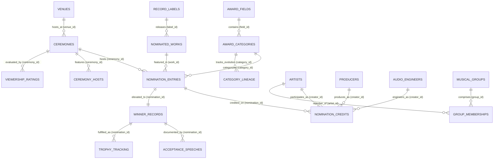
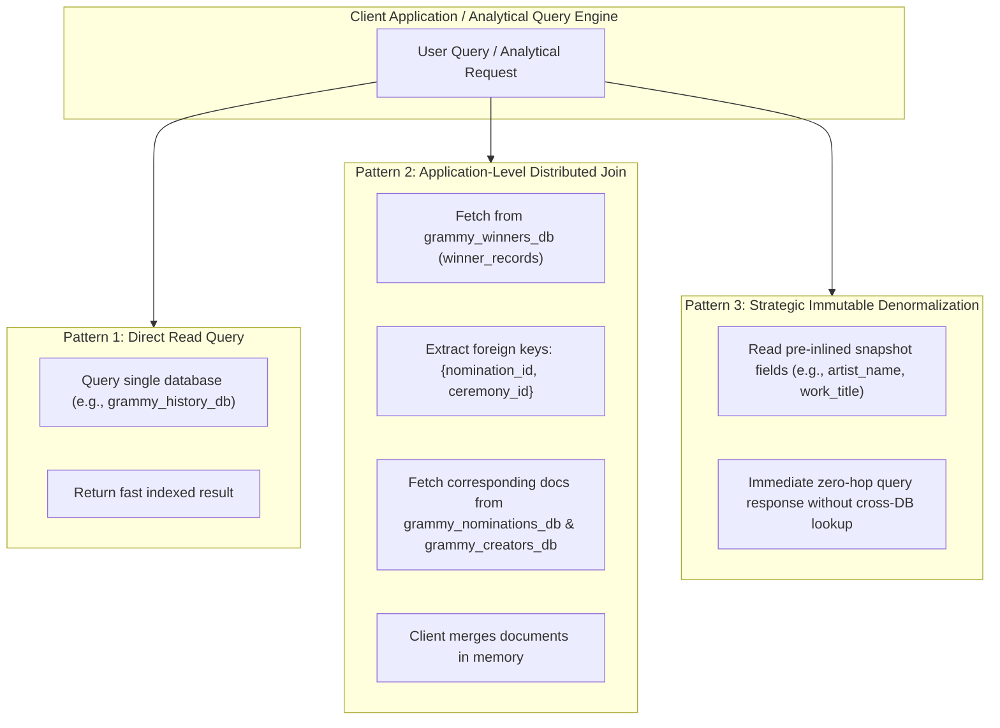

# Distributed System Architecture Specification

> **Course**: Advanced Database Management Systems (ADBMS)  
> **System**: GRAMMY Awards Information & Analytics System  
> **Phase**: Phase 5 — System Architecture  
> **Document**: Multi-Database Distributed Topology, Domain Bounded Contexts, Cross-Database Relationships & Storage Engine Specification  
> **Status**: Completed  
> **Lead Architect**: Database Architecture & Engineering Team  
> **Repository**: [GitHub Repository](https://github.com/bharathwajverse/music-grammy-awards-db.git)  

---

## 1. Executive Summary & Architectural Vision

The **GRAMMY Awards Information & Analytics System** is an enterprise-grade, distributed multi-database ecosystem modeled on the Recording Academy's real-world operational domains. Rather than adopting a naive monolithic database schema, the system deliberately partitions the GRAMMY lifecycle across **five discrete MongoDB databases** hosted on a cloud-native MongoDB Atlas replica set cluster.

```
                          ┌────────────────────────────────────────────────────────┐
                          │         MongoDB Atlas Cluster (cluster0.xhjfpv2)       │
                          │             WiredTiger Engine | 3-Node Replica Set     │
                          └──────────────────────────┬─────────────────────────────┘
                                                     │
         ┌─────────────────────┬───────────────────┼───────────────────┬─────────────────────┐
         ▼                     ▼                   ▼                   ▼                     ▼
┌─────────────────┐   ┌─────────────────┐ ┌─────────────────┐ ┌─────────────────┐   ┌─────────────────┐
│grammy_history_db│   │grammy_categories│ │grammy_nomination│ │grammy_winners_db│   │grammy_creators_ │
│                 │   │      _db        │ │      s_db       │ │                 │   │       db        │
│(Member 1 Scope) │   │(Member 2 Scope) │ │(Member 3 Scope) │ │(Member 4 Scope) │   │(Member 5 Scope) │
├─────────────────┤   ├─────────────────┤ ├─────────────────┤ ├─────────────────┤   ├─────────────────┤
│• ceremonies     │   │• award_fields   │ │• nomination_entr│ │• winner_records │   │• artists        │
│• venues         │   │• award_categorie│ │• nominated_works│ │• big_four_sweeps│   │• producers      │
│• telecasts      │   │• category_lineag│ │• nomination_cred│ │• record_breakers│   │• audio_engineers│
│• viewership     │   │• eligibility_rul│ │• submissions    │ │• speeches       │   │• songwriters    │
│• hosts          │   │• voting_rules   │ │• screening_batch│ │• trophy_tracking│   │• arrangers      │
│• milestones     │   │• category_quotas│ │• tied_nomination│ │• consecutive_win│   │• record_labels  │
│• eras           │   │• craft_credit_de│ │• audit_logs     │ │• hall_of_fame   │   │• musical_groups │
│• leadership     │   │• discontinued_ca│ │• genres         │ │• posthumous_awar│   │• group_members  │
│• media_accred   │   │• merged_split_hi│ │• first_time_nom │ │• win_benchmarks │   │• collaborations │
│• lifetime_honors│   │• special_merit  │ │• multi_packages │ │• press_releases │   │• discographies  │
└─────────────────┘   └─────────────────┘ └─────────────────┘ └─────────────────┘   └─────────────────┘
```

### Core Architecture Goals:
1. **Domain Isolation (DDD Bounded Contexts)**: Enforce clean boundaries between macro event logistics, legal/by-law taxonomy, submission/ballot processing, trophy celebration/records, and master creator directories.
2. **Deterministic Cross-Database Referencing**: Maintain absolute referential integrity across discrete databases using human-readable, deterministic identifier strings (`CEREMONY_{NNN}`, `CAT_{SLUG}`, `WRK_{SLUG}`, `NOM_{...}`, `WIN_{...}`, `CRT_{...}`).
3. **Rigorous Separation of Source Facts vs. Derived Statistics**: Primary historical truths (official ceremony dates, verified winners, master credit rolls) are strictly partitioned from downstream analytical derivatives (consecutive win streaks, genre market share, sweep indicators).
4. **Academic Syllabus Alignment**: Fully exercise core ADBMS concepts, including distributed data modeling, JSON Schema Draft-07 validation, multi-database query federation, client-side aggregation pipelines, indexing strategies, and disaster recovery.

---

## 2. Distributed Database Landscape & Responsibilities

The system divides domain responsibilities among five team members, assigning each member complete administrative, architectural, and data integrity ownership over one dedicated MongoDB database.

```mermaid
graph TB
    subgraph ClientLayer["Application & Analytics Layer"]
        CLI["Admin & Migration CLI Scripts"]
        VALIDATOR["Automated Quota & Referential Integrity Engine"]
        ANALYTICS["Distributed Cross-Database Aggregation Engine"]
        BI["Business Intelligence & Visualization Dashboards"]
    end

    subgraph Cluster["MongoDB Atlas Distributed Cluster (cluster0.xhjfpv2)"]
        subgraph DB1["1. grammy_history_db (Member 1 Lead)"]
            direction TB
            H1["ceremonies"] --- H2["venues"]
            H3["telecast_broadcasters"] --- H4["viewership_ratings"]
            H5["ceremony_hosts"] --- H6["historic_milestones"]
            H7["timeline_historical_eras"] --- H8["academy_leadership"]
            H9["press_media_accreditations"] --- H10["lifetime_achievement_honors"]
        end

        subgraph DB2["2. grammy_categories_db (Member 2 Lead)"]
            direction TB
            C1["award_fields"] --- C2["award_categories"]
            C3["category_lineage"] --- C4["eligibility_rules"]
            C5["voting_procedures"] --- C6["category_quotas_limits"]
            C7["craft_credit_definitions"] --- C8["discontinued_categories"]
            C9["merged_split_history"] --- C10["special_merit_categories"]
        end

        subgraph DB3["3. grammy_nominations_db (Member 3 Lead)"]
            direction TB
            N1["nomination_entries"] --- N2["nominated_works"]
            N3["nomination_credits"] --- N4["submission_batches"]
            N5["voter_screening_batches"] --- N6["tied_nominations"]
            N7["nomination_audit_logs"] --- N8["genre_classifications"]
            N9["first_time_nominees"] --- N10["multi_nomination_packages"]
        end

        subgraph DB4["4. grammy_winners_db (Member 4 Lead)"]
            direction TB
            W1["winner_records"] --- W2["big_four_sweeps"]
            W3["record_breakers"] --- W4["acceptance_speeches"]
            W5["trophy_tracking"] --- W6["consecutive_winners"]
            W7["hall_of_fame_inductions"] --- W8["posthumous_awards"]
            W9["historic_win_benchmarks"] --- W10["winner_press_releases"]
        end

        subgraph DB5["5. grammy_creators_db (Member 5 Lead)"]
            direction TB
            R1["artists"] --- R2["producers"]
            R3["audio_engineers"] --- R4["songwriters_composers"]
            R5["arrangers_conductors"] --- R6["record_labels"]
            R7["musical_groups"] --- R8["group_memberships"]
            R9["creator_collaborations"] --- R10["creator_discographies"]
        end
    end

    ClientLayer --> DB1
    ClientLayer --> DB2
    ClientLayer --> DB3
    ClientLayer --> DB4
    ClientLayer --> DB5
```



### 2.1. Member Domain Responsibilities Matrix

| Database Name | Lead Member | Bounded Context Mission | Primary Entities | Number of Collections |
| :--- | :--- | :--- | :--- | :--- |
| **`grammy_history_db`** | Member 1 | Ceremony event logistics, physical venue geography, television network telecasts, Nielsen ratings, hosts, governance leadership, and historical milestones. | `Ceremony`, `Venue`, `Broadcaster`, `ViewershipRating`, `Host`, `Milestone`, `Era`, `Leader` | 10 Collections |
| **`grammy_categories_db`** | Member 2 | Formal award governance taxonomy, award fields, category lineages, eligibility criteria, voting rules, quotas, craft thresholds, and discontinued categories. | `AwardField`, `AwardCategory`, `CategoryLineage`, `EligibilityRule`, `VotingRule`, `CraftDefinition` | 10 Collections |
| **`grammy_nominations_db`** | Member 3 | High-volume submission intake, voter screening batches, nomination ballots, nominated works, craft credit rosters, ballot ties, and Deloitte audit logs. | `NominationEntry`, `NominatedWork`, `NominationCredit`, `SubmissionBatch`, `ScreeningLog`, `GenreClassification` | 10 Collections |
| **`grammy_winners_db`** | Member 4 | Confirmed award winners, Big Four sweeps, all-time record benchmarks, physical statuette logistics, speech transcripts, Hall of Fame, and press releases. | `WinnerRecord`, `BigFourSweep`, `RecordBreaker`, `AcceptanceSpeech`, `TrophyRecord`, `ConsecutiveWin` | 10 Collections |
| **`grammy_creators_db`** | Member 5 | Master canonical entity registry of music creators, technical practitioners, songwriters, record labels, musical groups, memberships, and discographies. | `Artist`, `Producer`, `AudioEngineer`, `Songwriter`, `Arranger`, `RecordLabel`, `MusicalGroup`, `Collaboration` | 10 Collections |

---

## 3. Shared Entities & Cross-Database Relationships

In a distributed multi-database architecture, entities frequently intersect across domain boundaries. To prevent tight coupling, shared entities are modeled with an **authoritative home database** (the single source of truth) and referenced deterministically by foreign collections.



### 3.1. Master Shared Entity Topology

1. **Ceremony (`ceremony_id`)**:
   - **Authoritative Home**: `grammy_history_db.ceremonies`
   - **Foreign Inbound Consumers**:
     - `grammy_history_db.viewership_ratings` (Nielsen metrics for ceremony)
     - `grammy_history_db.ceremony_hosts` (Master of ceremonies per edition)
     - `grammy_history_db.press_media_accreditations` (Media passes issued for ceremony)
     - `grammy_nominations_db.nomination_entries` (Ballot ceremony tag)
     - `grammy_nominations_db.submission_batches` (Intake intake cycle)
     - `grammy_winners_db.winner_records` (Award year reference)
     - `grammy_winners_db.big_four_sweeps` (Sweep ceremony tag)

2. **Award Category (`category_id`)**:
   - **Authoritative Home**: `grammy_categories_db.award_categories`
   - **Foreign Inbound Consumers**:
     - `grammy_categories_db.category_lineage` (Genealogical history)
     - `grammy_categories_db.eligibility_rules` (Rulebook linking)
     - `grammy_nominations_db.nomination_entries` (Ballot category assignment)
     - `grammy_winners_db.consecutive_winners` (Category streak analysis)

3. **Nominated Work (`work_id`)**:
   - **Authoritative Home**: `grammy_nominations_db.nominated_works`
   - **Foreign Inbound Consumers**:
     - `grammy_nominations_db.nomination_entries` (Associated creative work)
     - `grammy_nominations_db.genre_classifications` (Genre tagging for work)
     - `grammy_nominations_db.multi_nomination_packages` (Multi-category packages)
     - `grammy_winners_db.hall_of_fame_inductions` (Historic induction linking)
     - `grammy_creators_db.creator_discographies` (Work release metadata)

4. **Nomination Ballot Entry (`nomination_id`)**:
   - **Authoritative Home**: `grammy_nominations_db.nomination_entries`
   - **Foreign Inbound Consumers**:
     - `grammy_nominations_db.nomination_credits` (Granular credit allocations)
     - `grammy_winners_db.winner_records` (Single authoritative win elevation)
     - `grammy_winners_db.acceptance_speeches` (Speeches delivered for win)
     - `grammy_winners_db.trophy_tracking` (Physical trophy manufactured)

5. **Creator / Artist (`creator_id`)**:
   - **Authoritative Home**: `grammy_creators_db.{artists, producers, audio_engineers, songwriters_composers, arrangers_conductors}`
   - **Foreign Inbound Consumers**:
     - `grammy_history_db.lifetime_achievement_honors` (Honoree profile)
     - `grammy_nominations_db.nomination_credits` (Credit participant ID)
     - `grammy_nominations_db.first_time_nominees` (Career first-time tracking)
     - `grammy_winners_db.record_breakers` (All-time record holder profile)
     - `grammy_winners_db.big_four_sweeps` (Artist sweeping general field)
     - `grammy_creators_db.group_memberships` (Artist in musical group)

---

## 4. Deterministic Universal Identifier Scheme

Because MongoDB does not enforce cross-database relational foreign keys at the storage engine level, the system implements a strict, deterministic string identifier standard. Every identifier is validated against formal Regular Expressions in JSON Schema Draft-07:

| Key Name | Canonical Regex Pattern | Representative Example | Home Database | Referenced By |
| :--- | :--- | :--- | :--- | :--- |
| **`ceremony_id`** | `^CEREMONY_[0-9]{3}$` | `CEREMONY_065` | `grammy_history_db` | `history`, `nominations`, `winners` |
| **`venue_id`** | `^VEN_[A-Z0-9_]+$` | `VEN_CRYPTO_COM_ARENA` | `grammy_history_db` | `history.ceremonies` |
| **`field_id`** | `^FLD_[A-Z0-9_]+$` | `FLD_GENERAL_FIELD` | `grammy_categories_db` | `categories.award_categories` |
| **`category_id`** | `^CAT_[A-Z0-9_]+$` | `CAT_ALBUM_OF_THE_YEAR` | `grammy_categories_db` | `nominations`, `winners` |
| **`rule_id`** | `^ELIG_[A-Z0-9_]+$` | `ELIG_AOTY_PLAYING_TIME` | `grammy_categories_db` | `categories.award_categories` |
| **`work_id`** | `^WRK_[A-Z0-9_]+$` | `WRK_RENAISSANCE_2022` | `grammy_nominations_db` | `nominations`, `creators`, `winners` |
| **`nomination_id`**| `^NOM_[0-9]{3}_[A-Z0-9_]+_[0-9]{2}$`| `NOM_065_AOTY_01` | `grammy_nominations_db` | `nominations.credits`, `winners.*` |
| **`winner_record_id`**| `^WIN_NOM_[0-9]{3}_[A-Z0-9_]+_[0-9]{2}$`| `WIN_NOM_065_AOTY_01` | `grammy_winners_db` | `winners.speeches`, `winners.trophies` |
| **`trophy_serial_no`**| `^TRP_[0-9]{4}_[A-Z0-9_]+$` | `TRP_2023_AOTY_001` | `grammy_winners_db` | `winners.trophy_tracking` |
| **`creator_id`** | `^CRT_[A-Z0-9_]+$` | `CRT_BEYONCE_KNOWLES` | `grammy_creators_db` | `history`, `nominations`, `winners`, `creators` |
| **`label_id`** | `^LBL_[A-Z0-9_]+$` | `LBL_COLUMBIA_RECORDS` | `grammy_creators_db` | `nominations.nominated_works` |
| **`group_id`** | `^GRP_[A-Z0-9_]+$` | `GRP_THE_BEATLES` | `grammy_creators_db` | `creators.group_memberships` |

---

## 5. Source-Data vs. Derived-Data Boundaries

To guarantee academic authenticity and auditing transparency, the architecture enforces a strict conceptual and structural separation between **Source Facts** and **Derived Analytics**.

```
┌────────────────────────────────────────────────────────────────────────────────────────┐
│                        SOURCE FACTS TIER (Primary & Secondary Ingest)                  │
├────────────────────────────────────────────────────────────────────────────────────────┤
│ • Canonical Ceremony Dates & Cities (Recording Academy Official Archives)              │
│ • Official Ballots & Nominee Credit Rosters (Deloitte / Academy Certified)             │
│ • Official Winner Announcements (Historical Trophy Dispatches)                         │
│ • Real Creator Identifiers & Discographies (MusicBrainz / Wikidata IDs)                │
│                                                                                        │
│   → Immutable once verified. 100% provenance traced to Source Registry.                │
└───────────────────────────────────────────┬────────────────────────────────────────────┘
                                            │
                                            ▼
┌────────────────────────────────────────────────────────────────────────────────────────┐
│                        DERIVED ANALYTICS TIER (Computed via Aggregations)              │
├────────────────────────────────────────────────────────────────────────────────────────┤
│ • Big Four General Field Sweeps (`big_four_sweeps`: Cross-category computed join)      │
│ • All-Time Record Breakers (`record_breakers`: Aggregated win count ranking tables)   │
│ • Consecutive Victory Streaks (`consecutive_winners`: Multi-year temporal windowing)   │
│ • First-Time Nominees (`first_time_nominees`: Longitudinal lifetime history diff)     │
│ • Multi-Nomination Packages (`multi_nomination_packages`: Work nomination clustering)  │
│ • Nielsen Demographic Trends (`historic_win_benchmarks`: Statistical distributions)    │
│                                                                                        │
│   → Re-computable on demand via deterministic aggregation pipelines.                   │
│   → Every derived document carries `computed_at`, `derivation_algorithm`, and lineage. │
└────────────────────────────────────────────────────────────────────────────────────────┘
```

### 5.1. Classification Criteria
1. **Source Data**:
   - Represents external, immutable real-world events or governance bylaws.
   - Example: Beyonce won Best Dance/Electronic Album at the 65th GRAMMY Awards.
   - Storage Rule: Never modified after ingestion; errors require formal errata patches.
2. **Derived Data**:
   - Represents synthetic indicators, computed aggregations, longitudinal ranks, or cross-database summaries.
   - Example: Beyonce holds the all-time record for most career GRAMMY wins (32 wins).
   - Storage Rule: Documents store explicit metadata fields (`derived_from`, `calculation_timestamp`, `aggregation_query_ref`) guaranteeing end-to-end reproducibility.

---

## 6. Distributed Query Patterns & Inter-Database Federation

MongoDB does not support cross-database joins natively within single aggregation pipelines across discrete cluster namespaces without specialized Atlas Data Federation. The system relies on three disciplined access patterns:



### 6.1. Pattern 1: Direct Single-Database Lookups
Used when queries are fully confined to a single domain context:
- Fetching venue capacity for `VEN_CRYPTO_COM_ARENA` from `grammy_history_db.venues`.
- Looking up eligibility rules for `CAT_ALBUM_OF_THE_YEAR` from `grammy_categories_db.eligibility_rules`.
- *Performance*: Sub-millisecond latency using unique B-tree indexed primary keys.

### 6.2. Pattern 2: Application-Level Distributed Joins (Client-Side Composition)
Used when analytical queries require deep entity stitching across multiple databases:
- Retrieving the full biographical profile, discography, and winning speech for a given winner record.
- **Protocol**:
  1. Primary query executed against `grammy_winners_db.winner_records`.
  2. Foreign keys (`nomination_id`, `ceremony_id`) extracted into an ID set.
  3. Secondary batch query executed against `grammy_nominations_db.nomination_entries` and `grammy_creators_db.artists` using `$in` clauses.
  4. Client application synthesizes the hydrated composite object.
- *Performance*: $O(1)$ indexed batch lookups with minimal network round-trips.

### 6.3. Pattern 3: Strategic Immutable Denormalization (Snapshot Inlining)
Used to optimize high-velocity analytical reads:
- In nomination and winner documents, essential human-readable display fields (`artist_name`, `work_title`, `category_name`, `ceremony_year`) are inlined alongside canonical foreign keys (`creator_id`, `work_id`, `category_id`, `ceremony_id`).
- *Rationale*: Historical awards facts are **immutable**. Once the 65th GRAMMY Awards concludes, the title of the Album of the Year and its winning artist will never change. Denormalizing these fields eliminates cross-database query fan-out while preserving zero drift risk.

---

## 7. Storage Engine & Technology Stack Specifications

```
┌────────────────────────────────────────────────────────────────────────────────────────┐
│                                 TECHNOLOGY STACK                                       │
├──────────────────────────┬─────────────────────────────────────────────────────────────┤
│ Database Engine          │ MongoDB Atlas 7.0+ (WiredTiger Storage Engine)              │
│ Cluster Topology         │ 3-Node Replica Set (Primary-Secondary-Secondary)           │
│ Connection Protocol      │ MongoDB SRV Connection String with TLS 1.3 & zlib           │
│ Schema Governance        │ JSON Schema Draft-07 (Client-side & Server-side validator)  │
│ Programming Language     │ Python 3.11+ / PyMongo 4.6+                                 │
│ Testing & Verification   │ Pytest 8.0+ / Jsonschema 4.21+                              │
│ Version Control & CI/CD  │ Git / GitHub Actions Automated Validation Matrix            │
└──────────────────────────┴─────────────────────────────────────────────────────────────┘
```

### 7.1. WiredTiger Storage Engine Configuration
- **Compression**: Snappy block-level compression for all document collections; prefix compression enabled on all B-tree indexes to minimize memory cache footprint.
- **Write Concern**: `w: "majority"`, `j: true` for audit, ballot, and winner collections to prevent dirty reads or data loss during failover.
- **Read Concern**: `local` for reporting pipelines; `majority` for financial and trophy fulfillment tracking.
- **Checkpointing & Journaling**: 60-second periodic checkpoint interval with write-ahead journaling guaranteeing ACID transaction durability at the single-database level.

### 7.2. PyMongo Connection Management
- **Connection Pooling**: Managed via `MongoClient(maxPoolSize=50, minPoolSize=10, maxIdleTimeMS=30000)`.
- **Secret Isolation**: Zero credentials hardcoded in repository files; connection strings dynamically resolved via `os.getenv("MONGODB_URI")` sourced from `.env`.

---

## 8. Architectural Decision Records (ADRs)

### ADR-01: Multi-Database Partitioning over Monolithic Single Database
- **Status**: Approved
- **Context**: An academic DBMS project requires demonstrating distributed enterprise architecture rather than treating MongoDB as a simple key-value store.
- **Decision**: Partition the domain into five discrete databases (`grammy_history_db`, `grammy_categories_db`, `grammy_nominations_db`, `grammy_winners_db`, `grammy_creators_db`).
- **Consequences**: Requires client-side join orchestration and deterministic global keys, but delivers complete domain encapsulation, independent scalability, and team-member accountability.

### ADR-02: Deterministic String Identifiers over Autogenerated MongoDB ObjectIds
- **Status**: Approved
- **Context**: Default MongoDB `_id` values (`ObjectId("65b...")`) are opaque, non-deterministic, and cannot be constructed offline or across distributed datasets.
- **Decision**: Standardize on human-readable, domain-semantic string primary keys (`CEREMONY_{NNN}`, `CAT_{SLUG}`, `WRK_{SLUG}`, `NOM_{...}`, `WIN_{...}`, `CRT_{...}`).
- **Consequences**: Ingestion pipelines are completely idempotent. Re-running migration scripts safely updates or inserts without duplicating records (`upsert: true`).

### ADR-03: Client-Side Join Federation over Distributed Multi-Document Transactions
- **Status**: Approved
- **Context**: MongoDB Atlas supports distributed transactions across multiple databases within the same cluster, but cross-database transactions introduce 2-Phase Commit (2PC) write locks, latency spikes, and deadlocks under bulk ingestion.
- **Decision**: Adopt client-side application joins and strategic immutable snapshot denormalization for read paths; enforce referential integrity via automated pre-flight CI/CD test suites.
- **Consequences**: High read throughput and zero distributed lock contention, backed by automated referential integrity guarantees.

### ADR-04: Strict Partitioning of Primary Source Facts vs. Derived Analytical Statistics
- **Status**: Approved
- **Context**: Conflating historical award facts with computed aggregations (e.g., storing Beyoncé's total win count directly inside her winner document) leads to update anomalies and stale analytics.
- **Decision**: Source facts (ballots, winners, ceremonies) remain immutable. All analytical rankings, sweeps, streaks, and benchmarks are segregated into dedicated derived collections with clear derivation metadata.
- **Consequences**: Guarantees source auditability and allows derived analytics to be recomputed deterministically at any time.

---

## 9. Security, Access Control & Fault Tolerance

1. **Network Whitelisting**: Strict IP access lists configured on MongoDB Atlas; production instances restricted to designated CI runner and development IP addresses.
2. **Role-Based Access Control (RBAC)**: Dedicated database user accounts configured with scoped privileges:
   - `member1_history_admin` $\rightarrow$ `readWrite` on `grammy_history_db` only.
   - `member2_categories_admin` $\rightarrow$ `readWrite` on `grammy_categories_db` only.
   - `member3_nominations_admin` $\rightarrow$ `readWrite` on `grammy_nominations_db` only.
   - `member4_winners_admin` $\rightarrow$ `readWrite` on `grammy_winners_db` only.
   - `member5_creators_admin` $\rightarrow$ `readWrite` on `grammy_creators_db` only.
   - `analytics_read_user` $\rightarrow$ `read` across all five databases.
3. **Fault Tolerance & Failure Isolation**: A temporary schema lock or bulk write queue on `grammy_nominations_db` does not impair operational read queries on `grammy_history_db` or `grammy_creators_db`.
