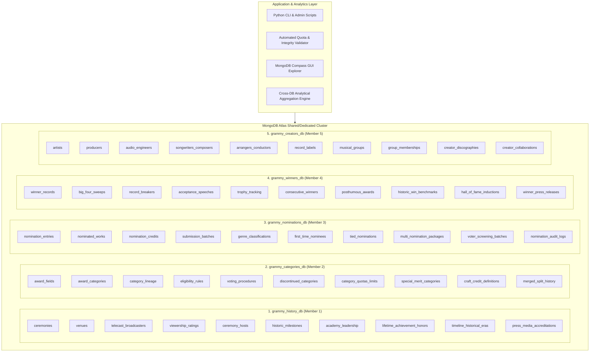

# System Topology & Multi-Database Architecture

## 1. High-Level System Architecture

The **GRAMMY Awards Information & Analytics System** is engineered as a distributed multi-database ecosystem. In contrast to a monolithic database design, partitioning the domain into five distinct databases reflects real-world institutional enterprise boundaries:
- **Operations & Media Affairs** (`grammy_history_db`)
- **Governance & Legal By-Laws** (`grammy_categories_db`)
- **Ballot & Voting Tabulation** (`grammy_nominations_db`)
- **Trophy Logistics & Records** (`grammy_winners_db`)
- **Creator Registry & Industry Relations** (`grammy_creators_db`)

## 2. Global Deterministic Identifier Standards

Because MongoDB collections do not enforce cross-database relational foreign key constraints at the storage engine level, the system establishes a deterministic identifier protocol:

1. **Ceremony Key**: `CEREMONY_{NNN}` (e.g., `CEREMONY_001` through `CEREMONY_067`).
2. **Category Key**: `CAT_{SLUG}` (e.g., `CAT_AOTY`, `CAT_ROTY`, `CAT_SOTY`, `CAT_BNA`, `CAT_BEST_POP_VOCAL_ALBUM`).
3. **Field Key**: `FLD_{SLUG}` (e.g., `FLD_GENERAL`, `FLD_POP`, `FLD_ROCK`, `FLD_RAP`, `FLD_JAZZ`).
4. **Nominated Work Key**: `WRK_{SLUG_YEAR}` (e.g., `WRK_THRILLER_1982`, `WRK_21_2011`).
5. **Nomination Key**: `NOM_{CEREMONY}_{CAT}_{SEQ}` (e.g., `NOM_065_AOTY_01`).
6. **Winner Key**: `WIN_{NOMINATION_ID}` (e.g., `WIN_NOM_065_AOTY_01`).
7. **Creator Key**: `CRT_{SLUG_SEQ}` (e.g., `CRT_QUINCY_JONES_001`, `CRT_ADELE_001`).
8. **Label Key**: `LBL_{SLUG}` (e.g., `LBL_COLUMBIA_RECORDS`, `LBL_MOTOWN`).
9. **Venue Key**: `VEN_{SLUG}` (e.g., `VEN_STAPLES_CENTER_LA`, `VEN_MADISON_SQUARE_GARDEN_NY`).

## 3. Cross-Database Query Strategies

Cross-database relationships are consumed via two distinct mechanisms:
1. **Application-Level Distributed Aggregation (Client-Side Join)**: Python analytical pipelines fetch correlated datasets across separate `MongoClient` database handles, joining on canonical identifiers.
2. **Denormalized Embedding for Read Optimization**: Frequently accessed reference fields (such as `entry_billing_title`, `display_artist_name`, and `ceremony_year`) are embedded in downstream documents with provenance tracking, avoiding heavy distributed joins for read-heavy analytical dashboards.
