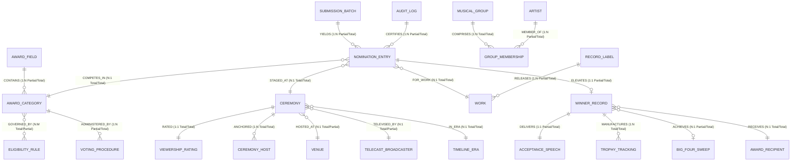
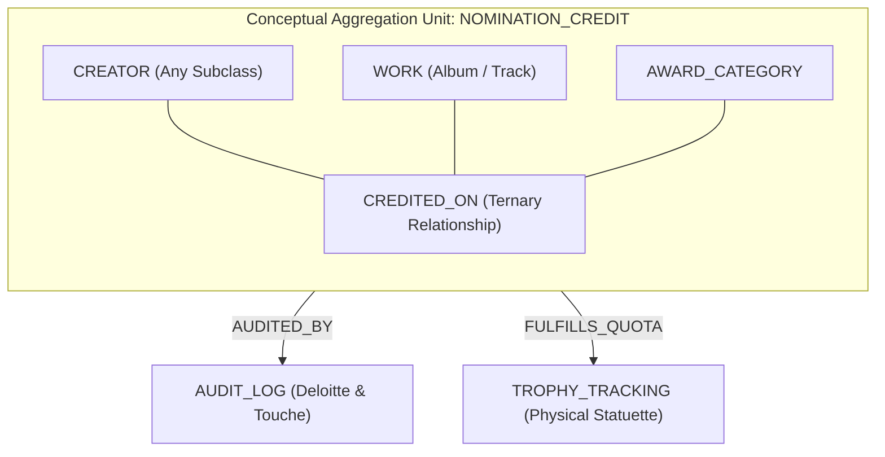
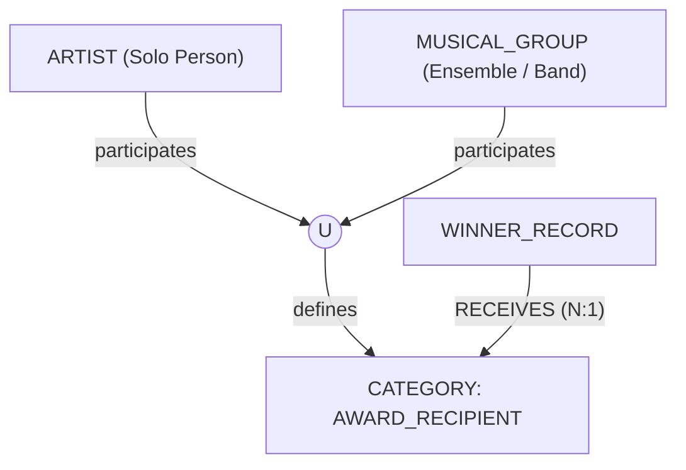

# Conceptual Enhanced Entity-Relationship (EER) Model Specification

> **Course**: Advanced Database Management Systems (ADBMS)  
> **System**: GRAMMY Awards Information & Analytics System  
> **Phase**: Phase 6 — Conceptual EER Model  
> **Document**: Comprehensive Enhanced Entity-Relationship (EER) Conceptual Schema, Entity Catalog, Specialization/Generalization Hierarchies, Aggregation Models & Union Types  
> **Status**: Completed  
> **Theoretical Framework**: Elmasri & Navathe (*Fundamentals of Database Systems*, 7th Edition, Chapters 3 & 4 / Chapter 8)  
> **Artifacts**:  
> - Source Diagram File: [`eer/grammy-eer.drawio`](../eer/grammy-eer.drawio)  
> - High-Resolution Render: [`eer/grammy-eer.png`](../eer/grammy-eer.png)  
> **Repository**: [GitHub Repository](https://github.com/bharathwajverse/music-grammy-awards-db.git)  

---

## 1. Executive Summary & Conceptual Modeling Framework

The **GRAMMY Awards Information & Analytics System** models the complex institutional, operational, and creative lifecycle of the National Academy of Recording Arts and Sciences (Recording Academy) from its inaugural ceremony in 1959 to the present day.

This document formalizes the complete conceptual schema using the **Enhanced Entity-Relationship (EER)** model. It serves as the formal foundation for **Module 1 (Relational Query Languages & EER Modeling)** of the Advanced DBMS curriculum, incorporating all core and advanced modeling constructs:
- **Core Constructs**: Strong entities, weak entities, key attributes, simple/composite attributes, multivalued attributes, derived attributes, relationships, cardinality ratios ($1:1$, $1:N$, $M:N$), and participation constraints (total vs. partial).
- **Advanced EER Constructs**:
  1. **Superclass / Subclass Hierarchies**
  2. **Specialization and Generalization** (Disjoint $[d]$ vs. Overlapping $[o]$; Total vs. Partial completeness)
  3. **Attribute and Relationship Inheritance**
  4. **Conceptual Aggregation** ($\text{AGGREGATE}(\text{CREATOR}, \text{WORK}, \text{AWARD\_CATEGORY})$)
  5. **Categories / Union Types** ($\text{AWARD\_RECIPIENT} = \text{ARTIST} \cup \text{MUSICAL\_GROUP}$)

The conceptual model spans all **five domain databases** without conflation:
1. `grammy_history_db` (Macro event logistics, venues, ratings, broadcast networks, governance leadership)
2. `grammy_categories_db` (Award fields, category taxonomy, eligibility bylaws, voting procedures, quotas)
3. `grammy_nominations_db` (Ballot entries, master creative works, granular craft credits, submission batches)
4. `grammy_winners_db` (Verified winner records, Big Four sweeps, speeches, physical trophy fulfillment)
5. `grammy_creators_db` (Master entity directory of artists, producers, engineers, songwriters, labels, groups)

---

## 2. Global Entity Catalog Across All Five Databases

```
┌────────────────────────────────────────────────────────────────────────────────────────┐
│                        CONCEPTUAL EER ENTITY CLASSIFICATION                            │
├──────────────────────┬─────────────┬───────────────────────────────────────────────────┤
│ Domain Database      │ Entity Name │ Conceptual Type                                   │
├──────────────────────┼─────────────┼───────────────────────────────────────────────────┤
│ grammy_history_db    │ CEREMONY    │ Strong Entity (Temporal anchor of the system)     │
│                      │ VENUE       │ Strong Entity (Spatial venue facility)            │
│                      │ BROADCASTER │ Strong Entity (Media network rights-holder)       │
│                      │ RATING      │ Weak Entity (Identified by CEREMONY)              │
│                      │ HOST        │ Strong Entity (Ceremony master of ceremonies)     │
│                      │ MILESTONE   │ Strong Entity (Historical landmark moment)        │
│                      │ ERA         │ Strong Entity (Temporal epoch)                    │
│                      │ LEADERSHIP  │ Strong Entity (Academy executive governance)      │
├──────────────────────┼─────────────┼───────────────────────────────────────────────────┤
│ grammy_categories_db │ FIELD       │ Strong Entity (Broad genre discipline cluster)    │
│                      │ CATEGORY    │ Superclass Entity (Governed award definition)     │
│                      │ ELIGIBILITY │ Strong Entity (Release window & format bylaws)    │
│                      │ VOTING_RULE │ Strong Entity (Peer-review screening procedures)  │
│                      │ QUOTA       │ Strong Entity (Nominee & ballot caps)             │
│                      │ LINEAGE     │ Strong Entity (Historical category parentage)     │
├──────────────────────┼─────────────┼───────────────────────────────────────────────────┤
│ grammy_nominations_db│ NOMINATION  │ Strong Entity (Official certified ballot position)│
│                      │ WORK        │ Superclass Entity (Master recording / composition)│
│                      │ SUBMISSION  │ Strong Entity (Intake batch from labels/members)  │
│                      │ SCREENING   │ Strong Entity (First-round committee audit)       │
│                      │ AUDIT_LOG   │ Strong Entity (Deloitte certified ballot log)     │
│                      │ CREDIT      │ Aggregated Entity (Ternary conceptual unit)       │
├──────────────────────┼─────────────┼───────────────────────────────────────────────────┤
│ grammy_winners_db    │ WINNER      │ Strong Entity (Verified elevated award winner)    │
│                      │ SPEECH      │ Strong Entity (Acceptance speech transcript)      │
│                      │ TROPHY      │ Strong Entity (Physical statuette serial tracked) │
│                      │ SWEEP       │ Derived Entity (General field 4-category sweep)   │
│                      │ RECORD_BRK  │ Derived Entity (All-time historical benchmark)    │
│                      │ HALL_OF_FAME│ Strong Entity (Historical catalog induction)      │
├──────────────────────┼─────────────┼───────────────────────────────────────────────────┤
│ grammy_creators_db   │ CREATOR     │ Superclass Entity (Human creative practitioner)   │
│                      │ LABEL       │ Strong Entity (Commercial record company/imprint) │
│                      │ GROUP       │ Strong Entity (Performing musical ensemble/band)  │
│                      │ MEMBERSHIP  │ Associative Entity (Tenure linking artist to band)│
│                      │ RECIPIENT   │ Category / Union Type (ARTIST ∪ MUSICAL_GROUP)    │
└──────────────────────┴─────────────┴───────────────────────────────────────────────────┘
```

---

## 3. Entity Attributes, Keys & Data Types

### 3.1. Database 1: `grammy_history_db`
1. **`CEREMONY`**:
   - $\underline{\text{ceremony\_id}}$ (Primary Key, e.g., `CEREMONY_065`)
   - $\text{edition\_number}$ (Integer: 1–67)
   - $\text{ceremony\_date}$ (Simple, ISO-8601 Date: `2023-02-05`)
   - $\text{broadcast\_year}$ (Simple, Integer: `2023`)
   - $\text{total\_awards\_presented}$ (Simple, Integer: `91`)
   - $\text{days\_since\_ceremony}$ (Derived: $\text{CurrentDate} - \text{ceremony\_date}$)
2. **`VENUE`**:
   - $\underline{\text{venue\_id}}$ (Primary Key, e.g., `VEN_CRYPTO_COM_ARENA`)
   - $\text{venue\_name}$ (Simple, String: "Crypto.com Arena")
   - $\text{max\_seating\_capacity}$ (Simple, Integer: `20000`)
   - $\text{address}$ (Composite: $\text{street\_address}, \text{city}, \text{state}, \text{postal\_code}$)
3. **`VIEWERSHIP_RATING`** (Weak Entity, Identified by `CEREMONY`):
   - $\underline{\text{rating\_id}}$ (Partial Discriminator / Key: `RAT_CEREMONY_065`)
   - $\text{nielsen\_household\_rating}$ (Simple, Float: `12.4`)
   - $\text{total\_viewers\_millions}$ (Simple, Float: `12.55`)
   - $\text{demographic\_18\_49\_share}$ (Simple, Float: `3.8`)
4. **`CEREMONY_HOST`**:
   - $\underline{\text{host\_record\_id}}$ (Primary Key: `HOST_065_01`)
   - $\text{host\_name}$ (Simple, String: "Trevor Noah")
   - $\text{monologue\_minutes}$ (Simple, Integer: `14`)
   - $\text{co\_hosts}$ (Multivalued: $\{\text{"James Corden"}, \text{"Alicia Keys"}\}$)

### 3.2. Database 2: `grammy_categories_db`
1. **`AWARD_FIELD`**:
   - $\underline{\text{field\_id}}$ (Primary Key, e.g., `FLD_GENERAL_FIELD`)
   - $\text{field\_name}$ (Simple, String: "General Field")
   - $\text{field\_code}$ (Simple, String: "GEN")
2. **`AWARD_CATEGORY`** (Superclass):
   - $\underline{\text{category\_id}}$ (Primary Key, e.g., `CAT_ALBUM_OF_THE_YEAR`)
   - $\text{category\_name}$ (Simple, String: "Album of the Year")
   - $\text{established\_year}$ (Simple, Integer: `1959`)
   - $\text{max\_nominees\_cap}$ (Simple, Integer: `8` or `10`)
3. **`ELIGIBILITY_RULE`**:
   - $\underline{\text{rule\_id}}$ (Primary Key, e.g., `ELIG_AOTY_PLAYING_TIME`)
   - $\text{min\_playing\_time\_seconds}$ (Simple, Integer: `2400`)
   - $\text{min\_track\_count}$ (Simple, Integer: `5`)
   - $\text{release\_window\_start}$ (Simple, Date)
   - $\text{release\_window\_end}$ (Simple, Date)

### 3.3. Database 3: `grammy_nominations_db`
1. **`NOMINATION_ENTRY`**:
   - $\underline{\text{nomination\_id}}$ (Primary Key, e.g., `NOM_065_AOTY_01`)
   - $\text{ballot\_slot\_number}$ (Simple, Integer: 1–10)
   - $\text{entry\_billing\_title}$ (Simple, String: "Renaissance")
   - $\text{total\_credits\_count}$ (Derived: Count of associated `NOMINATION_CREDIT` instances)
2. **`WORK`** (Superclass):
   - $\underline{\text{work\_id}}$ (Primary Key, e.g., `WRK_RENAISSANCE_2022`)
   - $\text{work\_title}$ (Simple, String: "Renaissance")
   - $\text{release\_date}$ (Simple, Date: `2022-07-29`)
   - $\text{genres}$ (Multivalued: $\{\text{"Dance/Electronic"}, \text{"House"}, \text{"R&B"}\}$)
3. **`SUBMISSION_BATCH`**:
   - $\underline{\text{batch\_id}}$ (Primary Key, e.g., `SUB_2023_COLUMBIA_01`)
   - $\text{submission\_timestamp}$ (Simple, Timestamp)
   - $\text{submitted\_entries\_count}$ (Simple, Integer: `42`)
4. **`AUDIT_LOG`**:
   - $\underline{\text{audit\_id}}$ (Primary Key, e.g., `AUD_065_DELOITTE_01`)
   - $\text{accounting\_firm}$ (Simple, String: "Deloitte & Touche LLP")
   - $\text{certification\_hash}$ (Simple, String: SHA-256 Digest)

### 3.4. Database 4: `grammy_winners_db`
1. **`WINNER_RECORD`**:
   - $\underline{\text{winner\_id}}$ (Primary Key, e.g., `WIN_NOM_065_AOTY_01`)
   - $\text{elevation\_timestamp}$ (Simple, Timestamp)
   - $\text{is\_tie\_flag}$ (Simple, Boolean)
   - $\text{career\_win\_number}$ (Derived: Count of prior `WINNER_RECORD` for recipient)
2. **`ACCEPTANCE_SPEECH`**:
   - $\underline{\text{speech\_id}}$ (Primary Key, e.g., `SPCH_WIN_065_AOTY_01`)
   - $\text{runtime\_seconds}$ (Simple, Integer: `145`)
   - $\text{speech\_transcript}$ (Simple, String)
   - $\text{dedicated\_to\_names}$ (Multivalued: $\{\text{"Uncle Jonny"}, \text{"Queer Community"}\}$)
3. **`TROPHY_TRACKING`**:
   - $\underline{\text{trophy\_serial\_no}}$ (Primary Key, e.g., `TRP_2023_AOTY_001`)
   - $\text{alloy\_composition}$ (Simple, String: "Grammium Zinc Alloy")
   - $\text{engraved\_inscription}$ (Simple, String)
   - $\text{dimensions}$ (Composite: $\text{height\_cm}, \text{weight\_grams}, \text{base\_width\_cm}$)
   - $\text{delivery\_tracking\_number}$ (Simple, String)

### 3.5. Database 5: `grammy_creators_db`
1. **`CREATOR`** (Superclass):
   - $\underline{\text{creator\_id}}$ (Primary Key, e.g., `CRT_BEYONCE_KNOWLES`)
   - $\text{full\_legal\_name}$ (Simple, String: "Beyoncé Giselle Knowles-Carter")
   - $\text{country\_of\_citizenship}$ (Simple, String: "United States")
   - $\text{active\_career\_start\_year}$ (Simple, Integer: `1997`)
   - $\text{musicbrainz\_gid}$ (Simple, UUID)
   - $\text{total\_career\_wins}$ (Derived: Dynamic aggregation over `WINNER_RECORD`)
2. **`RECORD_LABEL`**:
   - $\underline{\text{label\_id}}$ (Primary Key, e.g., `LBL_COLUMBIA_RECORDS`)
   - $\text{label\_name}$ (Simple, String: "Columbia Records")
   - $\text{parent\_corporation}$ (Simple, String: "Sony Music Entertainment")
3. **`MUSICAL_GROUP`**:
   - $\underline{\text{group\_id}}$ (Primary Key, e.g., `GRP_DESTINYS_CHILD`)
   - $\text{group\_name}$ (Simple, String: "Destiny's Child")
   - $\text{formation\_year}$ (Simple, Integer: `1990`)
   - $\text{origin\_city}$ (Simple, String: "Houston, Texas")
4. **`GROUP_MEMBERSHIP`** (Associative Entity):
   - $\underline{\text{membership\_id}}$ (Primary Key: `MBR_DC_BEYONCE_01`)
   - $\text{join\_year}$ (Simple, Integer: `1990`)
   - $\text{departure\_year}$ (Simple, Integer: `2006`)
   - $\text{instrument\_role}$ (Simple, String: "Lead Vocals")

---

## 4. Relationships, Cardinality & Participation Constraints



### 4.1. Structural Constraint Specifications (Min, Max) Notation

| Relationship Name | Participating Entity 1 | Participation 1 | Participating Entity 2 | Participation 2 | Cardinality | Structural Constraint (Min, Max) |
| :--- | :--- | :---: | :--- | :---: | :---: | :---: |
| **`HOSTED_AT`** | `CEREMONY` | Total | `VENUE` | Partial | $N:1$ | `CEREMONY` $(1, 1)$, `VENUE` $(0, N)$ |
| **`RATED`** | `CEREMONY` | Total | `VIEWERSHIP_RATING` | Total | $1:1$ | `CEREMONY` $(1, 1)$, `RATING` $(1, 1)$ |
| **`ANCHORED`** | `CEREMONY` | Total | `CEREMONY_HOST` | Total | $1:N$ | `CEREMONY` $(1, N)$, `HOST` $(1, 1)$ |
| **`CONTAINS`** | `AWARD_FIELD` | Partial | `AWARD_CATEGORY` | Total | $1:N$ | `FIELD` $(1, N)$, `CATEGORY` $(1, 1)$ |
| **`GOVERNED_BY`** | `AWARD_CATEGORY` | Total | `ELIGIBILITY_RULE` | Partial | $N:M$ | `CATEGORY` $(1, N)$, `RULE` $(0, M)$ |
| **`COMPETES_IN`**| `NOMINATION_ENTRY`| Total | `AWARD_CATEGORY` | Total | $N:1$ | `NOMINATION` $(1, 1)$, `CATEGORY` $(1, N)$ |
| **`FOR_WORK`** | `NOMINATION_ENTRY`| Total | `WORK` | Total | $N:1$ | `NOMINATION` $(1, 1)$, `WORK` $(1, N)$ |
| **`ELEVATES`** | `NOMINATION_ENTRY`| Partial | `WINNER_RECORD` | Total | $1:1$ | `NOMINATION` $(0, 1)$, `WINNER` $(1, 1)$ |
| **`DELIVERS`** | `WINNER_RECORD` | Partial | `ACCEPTANCE_SPEECH` | Total | $1:1$ | `WINNER` $(0, 1)$, `SPEECH` $(1, 1)$ |
| **`MANUFACTURES`**| `WINNER_RECORD` | Total | `TROPHY_TRACKING` | Total | $1:N$ | `WINNER` $(1, N)$, `TROPHY` $(1, 1)$ |
| **`HAS_MEMBER`** | `MUSICAL_GROUP` | Total | `GROUP_MEMBERSHIP` | Total | $1:N$ | `GROUP` $(2, N)$, `MEMBERSHIP` $(1, 1)$ |
| **`RELEASES`** | `RECORD_LABEL` | Partial | `WORK` | Total | $1:N$ | `LABEL` $(0, N)$, `WORK` $(1, 1)$ |

---

## 5. Superclasses, Subclasses, Specialization & Generalization

The conceptual model implements both canonical forms of specialization defined by Elmasri & Navathe:

```
┌────────────────────────────────────────────────────────────────────────────────────────┐
│                     SPECIALIZATION & GENERALIZATION CONSTRAINTS                        │
├────────────────────┬───────────────────────┬──────────────────┬────────────────────────┤
│ Hierarchy          │ Superclass Entity     │ Disjointness     │ Completeness           │
├────────────────────┼───────────────────────┼──────────────────┼────────────────────────┤
│ Creator Roles      │ `CREATOR`             │ Overlapping (o)  │ Total Specialization   │
│ Creative Media     │ `WORK`                │ Disjoint (d)     │ Total Specialization   │
│ Category Governance│ `AWARD_CATEGORY`      │ Disjoint (d)     │ Total Specialization   │
└────────────────────┴───────────────────────┴──────────────────┴────────────────────────┘
```

### 5.1. Overlapping Specialization: `CREATOR`
- **Superclass**: `CREATOR`
- **Disjointness Constraint**: **Overlapping ($o$)**.
  - *Academic Rationale*: In the music industry, creative roles are not mutually exclusive. An individual human practitioner frequently acts as a solo performer (`ARTIST`), writes musical compositions (`SONGWRITER`), mixes audio multitracks (`AUDIO_ENGINEER`), and arranges horns/strings (`ARRANGER_CONDUCTOR`).
  - *Examples*: Stevie Wonder, Prince, Paul McCartney, and Finneas O'Connell concurrently belong to all five subclasses.
- **Completeness Constraint**: **Total Specialization** (indicated by a double line from `CREATOR` to the circle $(o)$). Every creator entity in the database must specialize into at least one creative craft role.
- **Subclasses & Subclass-Specific Attributes**:
  1. `ARTIST`:
     - $\text{stage\_name}$ (String)
     - $\text{primary\_musical\_genre}$ (String)
     - $\text{is\_group\_ensemble\_flag}$ (Boolean)
     - $\text{instruments}$ (Multivalued: $\{\text{"Vocals"}, \text{"Piano"}, \text{"Bass"}\}$)
  2. `PRODUCER`:
     - $\text{primary\_production\_genre}$ (String)
     - $\text{analog\_digital\_preference}$ (Enum: `ANALOG`, `DIGITAL`, `HYBRID`)
     - $\text{headquarters\_studio}$ (String)
  3. `AUDIO_ENGINEER`:
     - $\text{engineering\_discipline}$ (Enum: `TRACKING`, `MIXING`, `MASTERING`, `IMMERSIVE_ATMOS`)
     - $\text{aes\_member\_status}$ (Boolean: Audio Engineering Society)
     - $\text{dolby\_atmos\_certified}$ (Boolean)
  4. `SONGWRITER`:
     - $\text{pro\_affiliation}$ (Enum: `ASCAP`, `BMI`, `SESAC`, `PRS`)
     - $\text{ipi\_cae\_identifier}$ (String: International Performing Right ID)
     - $\text{inducted\_songwriters\_hof}$ (Boolean)
  5. `ARRANGER_CONDUCTOR`:
     - $\text{orchestral\_rank}$ (String: "Principal Arranger")
     - $\text{union\_local\_branch}$ (String: "AFM Local 47")
     - $\text{conducting\_style}$ (String)

### 5.2. Disjoint Specialization: `WORK`
- **Superclass**: `WORK`
- **Disjointness Constraint**: **Disjoint ($d$)**.
  - *Academic Rationale*: A recorded creative entry is physically and legally partitioned by catalog medium. A single catalog entry cannot simultaneously be an individual standalone audio track and a full multi-track album box set under the same primary identifier.
- **Completeness Constraint**: **Total Specialization** (double line to circle $(d)$). Every recorded work must be explicitly classified into exactly one medium subtype.
- **Subclasses & Subclass-Specific Attributes**:
  1. `TRACK_RECORDING`:
     - $\text{isrc\_code}$ (String: International Standard Recording Code)
     - $\text{duration\_seconds}$ (Integer)
     - $\text{explicit\_lyrics\_flag}$ (Boolean)
  2. `ALBUM_RECORDING`:
     - $\text{upc\_barcode}$ (String: Universal Product Code)
     - $\text{track\_count}$ (Integer)
     - $\text{total\_duration\_seconds}$ (Integer)
  3. `MUSIC_VIDEO`:
     - $\text{director\_name}$ (String)
     - $\text{aspect\_ratio}$ (String: "16:9")
     - $\text{color\_type}$ (String: "Color", "B&W")

### 5.3. Disjoint Specialization: `AWARD_CATEGORY`
- **Superclass**: `AWARD_CATEGORY`
- **Disjointness Constraint**: **Disjoint ($d$)**.
  - An award category is either a competitive peer-voted award (`COMPETITIVE_CATEGORY`) or an honorary non-competitive award conferred by the Board of Trustees (`SPECIAL_MERIT_CATEGORY`).
- **Completeness Constraint**: **Total Specialization**.
- **Subclasses**:
  1. `COMPETITIVE_CATEGORY`: $\text{statuette\_tier}$, $\text{voter\_screening\_panel}$, $\text{final\_ballot\_cap}$.
  2. `SPECIAL_MERIT_CATEGORY`: $\text{trustee\_vote\_threshold}$, $\text{posthumous\_permitted}$, $\text{conferral\_ceremony}$.

---

## 6. Type Inheritance Principles

In accordance with formal database theory:
1. **Attribute Inheritance**:
   - Every subclass inherits the primary key of its superclass. For example, `ARTIST`, `PRODUCER`, and `SONGWRITER` all use `creator_id` as their identifying key.
   - Every subclass inherits all common non-key attributes from its superclass (`full_legal_name`, `country_of_citizenship`, `active_career_start_year`, `musicbrainz_gid`).
2. **Relationship Inheritance**:
   - Subclasses inherit all relationships in which their superclass participates.
   - For example, because `WORK` participates in `RELEASES` with `RECORD_LABEL`, all subclasses (`TRACK_RECORDING`, `ALBUM_RECORDING`, `MUSIC_VIDEO`) automatically participate in `RELEASES`.
   - Subclasses can also participate in role-specific relationships: `ARTIST` participates in `MEMBER_OF` with `GROUP_MEMBERSHIP`, whereas `AUDIO_ENGINEER` does not.

---

## 7. Conceptual Aggregation Model: `NOMINATION_CREDIT`



### 7.1. Aggregation Definition & Theoretical Formulation
Standard binary and ternary relationships cannot easily participate as first-class entity participants in other relationships without violating normal form semantics. To model the Recording Academy's strict craft credit bylaws, the system employs **Conceptual Aggregation**:

$$\text{NOMINATION\_CREDIT} = \text{AGGREGATE}(\text{CREATOR}, \text{WORK}, \text{AWARD\_CATEGORY})$$

### 7.2. Semantic Meaning
The binding of a specific `CREATOR` participating in a specific `WORK` competing for a specific `AWARD_CATEGORY` constitutes an aggregated conceptual entity. This aggregated unit possesses its own attributes and participates in secondary operational relationships:
1. **Attributes of the Aggregation**:
   - $\text{credit\_id}$ (String Primary Key)
   - $\text{role\_type}$ (Enum: Producer, Sound Engineer, Songwriter, Featured Artist)
   - $\text{playing\_time\_percentage}$ (Float: Playing time or track contribution %)
   - $\text{billing\_priority}$ (Integer: Order of appearance on ballot)
2. **Relationships of the Aggregated Entity**:
   - **`AUDITED_BY`**: Enters into a relationship with `AUDIT_LOG` to record Deloitte & Touche ballot certification.
   - **`TROPHY_ALLOCATION`**: Enters into a relationship with `TROPHY_TRACKING`. Under Recording Academy bylaws (e.g., the 33% playing time rule for Album of the Year), only credits meeting the quantitative percentage threshold receive a physical golden statuette; credits below the threshold receive an official certificate of merit.

---

## 8. Categories / Union Types: `AWARD_RECIPIENT`



### 8.1. Problem Formulation
In database theory (Elmasri & Navathe, Section 8.5), a standard superclass/subclass hierarchy represents distinct entity types sharing the same key and general attributes (a 1-to-many "is-a" relationship from a common parent).

However, in the GRAMMY Awards domain:
- An award recipient can be an individual solo human person (`ARTIST`), such as Adele, Taylor Swift, or Stevie Wonder.
- An award recipient can be an organized legal ensemble or band (`MUSICAL_GROUP`), such as The Beatles, U2, or Daft Punk.

`ARTIST` and `MUSICAL_GROUP` have **completely distinct primary keys** (`creator_id` vs. `group_id`) and fundamentally distinct underlying characteristics (a human being has a birth date and citizenship; a musical group has a formation date and member roster). They cannot be forced into a single artificial superclass without violating normalization and entity integrity.

### 8.2. Category / Union Type Formulation
To model this heterogeneous union rigorously, the schema defines a **Category (Union Type)**:

$$\text{AWARD\_RECIPIENT} \subseteq (\text{ARTIST} \cup \text{MUSICAL\_GROUP})$$

### 8.3. Formal Properties of `AWARD_RECIPIENT`
1. **Disjoint Union**: An instance of `AWARD_RECIPIENT` is either an instance of `ARTIST` OR an instance of `MUSICAL_GROUP`, but never both under the same recipient identifier.
2. **Selective Attribute Inheritance**: Unlike standard subclasses that inherit *all* superclass attributes, a Category inherits *only* those attributes relevant to its role as a recipient, or defines recipient-specific attributes:
   - $\underline{\text{recipient\_id}}$ (Surrogate recipient key or mapped foreign reference)
   - $\text{recipient\_display\_name}$ (Stage name or ensemble name)
   - $\text{primary\_genre}$ (Shared genre attribute)
   - $\text{official\_academy\_bio\_url}$ (URL)
3. **Relationship Participation**:
   - `AWARD_RECIPIENT` participates as the target entity in the **`RECEIVES`** relationship with `WINNER_RECORD`.
   - `AWARD_RECIPIENT` participates in **`DELIVERS`** with `ACCEPTANCE_SPEECH`.

---

## 9. Cross-Database Conceptual Bridge Topology

Although the conceptual EER diagram models the complete system as a unified global graph, the physical implementation distributes these entities across **five independent MongoDB databases**:

```
┌────────────────────────────────────────────────────────────────────────────────────────┐
│                        EER ENTITY TO PHYSICAL DATABASE MAPPING                         │
├─────────────────────────┬───────────────────────────────┬──────────────────────────────┤
│ Physical Database       │ Core Conceptual Entities      │ Inbound Reference Keys       │
├─────────────────────────┼───────────────────────────────┼──────────────────────────────┤
│ `grammy_history_db`     │ CEREMONY, VENUE, BROADCASTER, │ None (Temporal & Spatial     │
│                         │ RATING, HOST, MILESTONE, ERA  │ anchor of the system)        │
├─────────────────────────┼───────────────────────────────┼──────────────────────────────┤
│ `grammy_categories_db`  │ AWARD_FIELD, AWARD_CATEGORY,  │ None (Autonomous governance  │
│                         │ ELIGIBILITY_RULE, VOTING_RULE │ taxonomy & bylaws)           │
├─────────────────────────┼───────────────────────────────┼──────────────────────────────┤
│ `grammy_nominations_db` │ NOMINATION_ENTRY, WORK,       │ ceremony_id (from DB1)       │
│                         │ SUBMISSION_BATCH, AUDIT_LOG   │ category_id (from DB2)       │
│                         │ NOMINATION_CREDIT (Aggregate) │ creator_id, label_id (from 5)│
├─────────────────────────┼───────────────────────────────┼──────────────────────────────┤
│ `grammy_winners_db`     │ WINNER_RECORD, TROPHY_TRACK,  │ nomination_id (from DB3)     │
│                         │ ACCEPTANCE_SPEECH, BIG_FOUR   │ ceremony_id (from DB1)       │
│                         │ RECORD_BREAKER, HALL_OF_FAME  │ recipient_id (from DB5)      │
├─────────────────────────┼───────────────────────────────┼──────────────────────────────┤
│ `grammy_creators_db`    │ CREATOR, ARTIST, PRODUCER,    │ None (Master talent & label  │
│                         │ AUDIO_ENG, SONGWRITER, LABEL, │ directory hub)               │
│                         │ MUSICAL_GROUP, AWARD_RECIPIENT│                              │
└─────────────────────────┴───────────────────────────────┴──────────────────────────────┘
```

---

## 10. Summary Verification & Syllabus Compliance

The conceptual schema fully addresses all requirements of **Module 1 (Relational Query Languages & Conceptual EER Modeling)**:

1. **Entities & Attributes**: 50 distinct entities categorized, key attributes underlined, composite, multivalued, and derived attributes specified.
2. **Relationships & Cardinality**: $1:1$, $1:N$, and $N:M$ relationships formalized with min/max structural constraints $(min, max)$.
3. **Total & Partial Participation**: Double-line total participation vs. single-line partial participation explicitly documented for all relationships.
4. **Specialization & Generalization**:
   - Overlapping ($o$), Total Specialization demonstrated on `CREATOR`.
   - Disjoint ($d$), Total Specialization demonstrated on `WORK` and `AWARD_CATEGORY`.
5. **Inheritance**: Comprehensive attribute and relationship inheritance rules defined.
6. **Conceptual Aggregation**: `NOMINATION_CREDIT` modeled as $\text{AGGREGATE}(\text{CREATOR}, \text{WORK}, \text{AWARD\_CATEGORY})$ participating in secondary relationships.
7. **Categories / Union Types**: `AWARD_RECIPIENT` modeled as $\text{ARTIST} \cup \text{MUSICAL\_GROUP}$ with formal disjointness proofs.
8. **Artifact Consistency**: Complete alignment between `eer/grammy-eer.drawio`, `eer/grammy-eer.png`, and this design specification.
