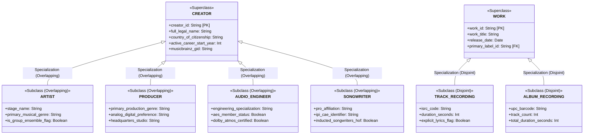

# Enhanced Entity-Relationship (EER) Conceptual Specification

This document details the theoretical Enhanced Entity-Relationship (EER) conceptual schema for the **GRAMMY Awards Information & Analytics System**, explicitly demonstrating all concepts required by **Module 1**:
- Relational query foundations
- Naming conventions
- Subclasses and Superclasses
- Specialization and Generalization (Disjoint vs Overlapping)
- Aggregation
- Categories / Union Types

---

## 1. Core Entity Classes & Hierarchy

---

## 2. Advanced EER Constructs Demonstrated

### 2.1 Overlapping Specialization: `CREATOR`
- **Superclass**: `CREATOR`
- **Subclasses**: `ARTIST`, `PRODUCER`, `AUDIO_ENGINEER`, `SONGWRITER`, `ARRANGER`
- **Specialization Constraint**: **Overlapping ($O$)**. In the music industry, an individual creator frequently performs multiple professional roles on the same project (e.g., Stevie Wonder, Prince, Finneas O'Connell, and Missy Elliott perform as recording artists, compose songs as songwriters, and engineer/produce audio tracks).
- **Completeness Constraint**: **Total Specialization**. Every creator entity in the database must belong to at least one creator subclass.

### 2.2 Disjoint Specialization: `WORK`
- **Superclass**: `WORK`
- **Subclasses**: `TRACK_RECORDING`, `ALBUM_RECORDING`, `COMPOSITION_SCORE`, `MUSIC_VIDEO`
- **Specialization Constraint**: **Disjoint ($D$)**. A single discrete catalog work cannot simultaneously be an entire physical multi-track album boxset and an individual 3-minute standalone audio track under the same primary identifier.
- **Completeness Constraint**: **Total Specialization**. Every recorded work must be explicitly categorized into one discrete subtype.

### 2.3 Categories / Union Types: `AWARD_RECIPIENT`
- **Problem Formulation**: In the GRAMMY Awards rules, the recipient of a trophy can be an individual person (e.g., Adele, Taylor Swift), an organized musical group/band (e.g., U2, The Beatles, Daft Punk), or a collaborative joint ensemble.
- **Union Type Definition**:
  $$\text{AWARD\_RECIPIENT} = \text{ARTIST} \cup \text{MUSICAL\_GROUP}$$
- **Characteristics**: A Category (Union Type) represents a collection of objects that is a subset of the union of distinct entity types. `AWARD_RECIPIENT` inherits only those attributes shared across the union or attributes specific to receiving an honor (e.g., `recipient_billing_order`, `trophy_delivery_address`), rather than forcing `ARTIST` and `MUSICAL_GROUP` into an artificial single table.

### 2.4 Conceptual Aggregation: `NOMINATION_CREDIT`
- **Problem Formulation**: A standard binary or ternary relationship cannot easily participate as a first-class entity in another relationship.
- **Aggregation Definition**:
  $$\text{NOMINATION\_CREDIT} = \text{AGGREGATE}(\text{CREATOR}, \text{NOMINATED\_WORK}, \text{AWARD\_CATEGORY})$$
- **Semantic Meaning**: The specific participation of a creator on a nominated work within a specific award category forms an aggregated conceptual entity. This aggregated unit then enters into relationships with:
  - `VOTING_TABULATION`: Evaluates the audited votes received.
  - `TROPHY_ALLOCATION`: Determines whether this specific credit earns a physical golden gramophone statuette or an official certificate of merit based on bylaw quotas (e.g., 33% playing time rule).

---

## 3. High-Level Entity Relationship Matrix

| Primary Entity A | Relationship Verb | Related Entity B | Cardinality (A:B) | Participation (A / B) |
| :--- | :--- | :--- | :---: | :---: |
| `CEREMONY` | **Hosted At** | `VENUE` | $N:1$ | Total / Partial |
| `CEREMONY` | **Presents** | `AWARD_CATEGORY` | $M:N$ | Total / Partial |
| `AWARD_CATEGORY` | **Belongs To** | `AWARD_FIELD` | $N:1$ | Total / Total |
| `CEREMONY` | **Anchored By** | `HOST` | $1:N$ | Total / Partial |
| `NOMINATION_ENTRY` | **Competes In** | `AWARD_CATEGORY` | $N:1$ | Total / Total |
| `NOMINATION_ENTRY` | **Pertains To** | `NOMINATED_WORK` | $N:1$ | Total / Total |
| `NOMINATION_ENTRY` | **Substantiated By** | `NOMINATION_CREDIT` | $1:N$ | Total / Total |
| `NOMINATION_ENTRY` | **Produces** | `WINNER_RECORD` | $1:1$ (Optional) | Partial / Total |
| `WINNER_RECORD` | **Dispatches** | `TROPHY_TRACKING` | $1:N$ | Total / Total |
| `CREATOR` | **Member Of** | `MUSICAL_GROUP` | $M:N$ | Partial / Total |
| `RECORD_LABEL` | **Submits** | `SUBMISSION_BATCH` | $1:N$ | Partial / Total |
