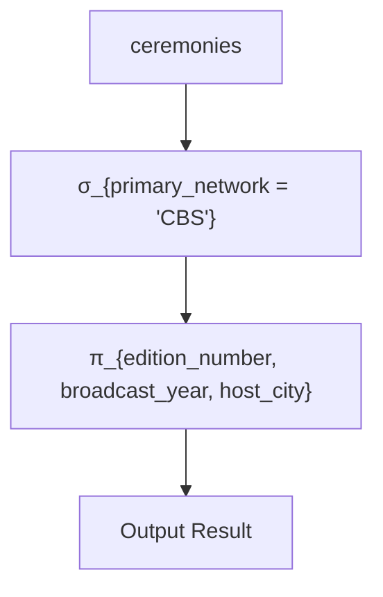
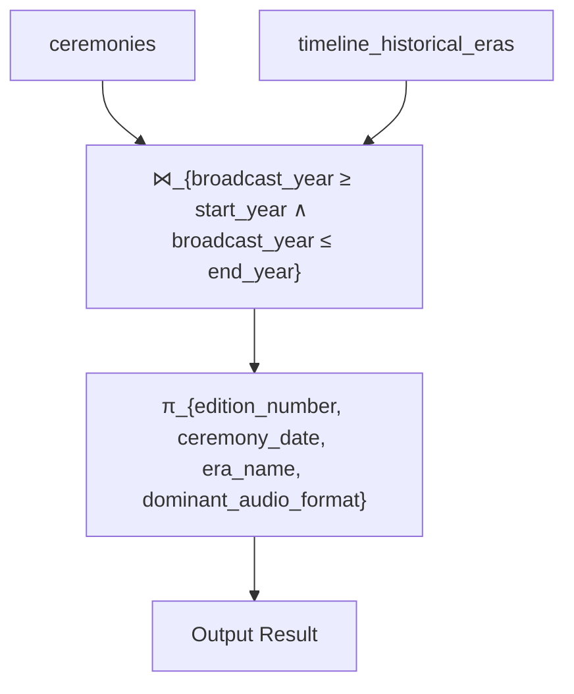
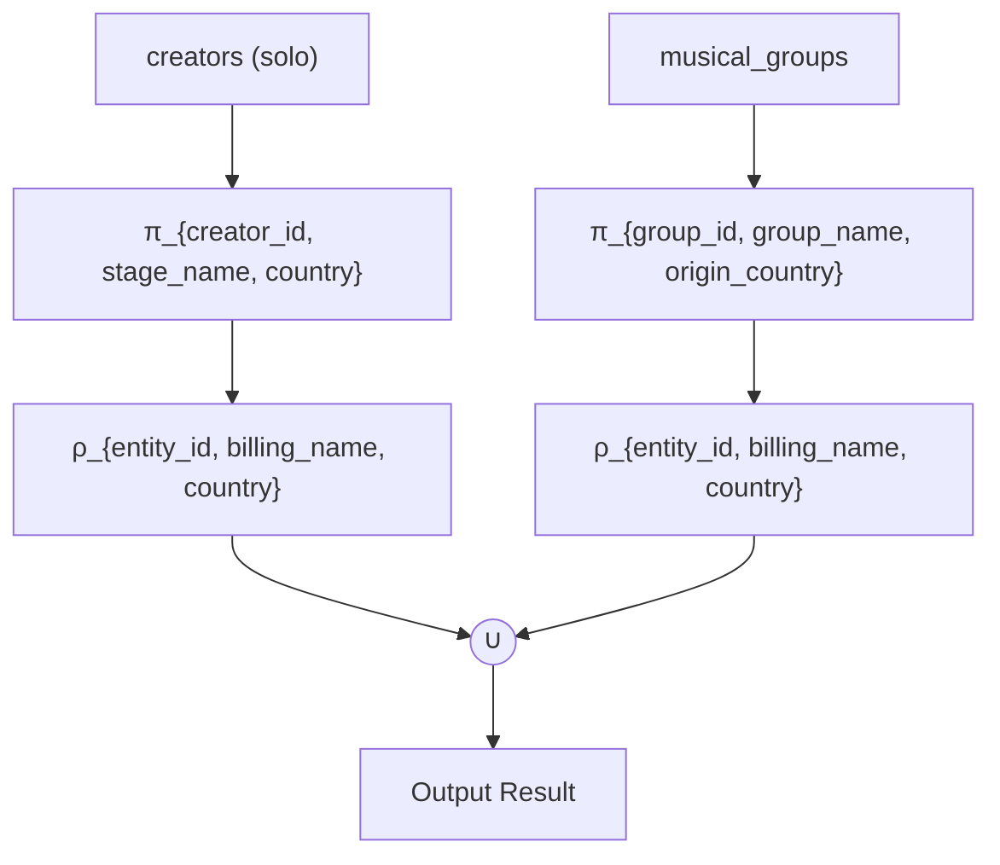
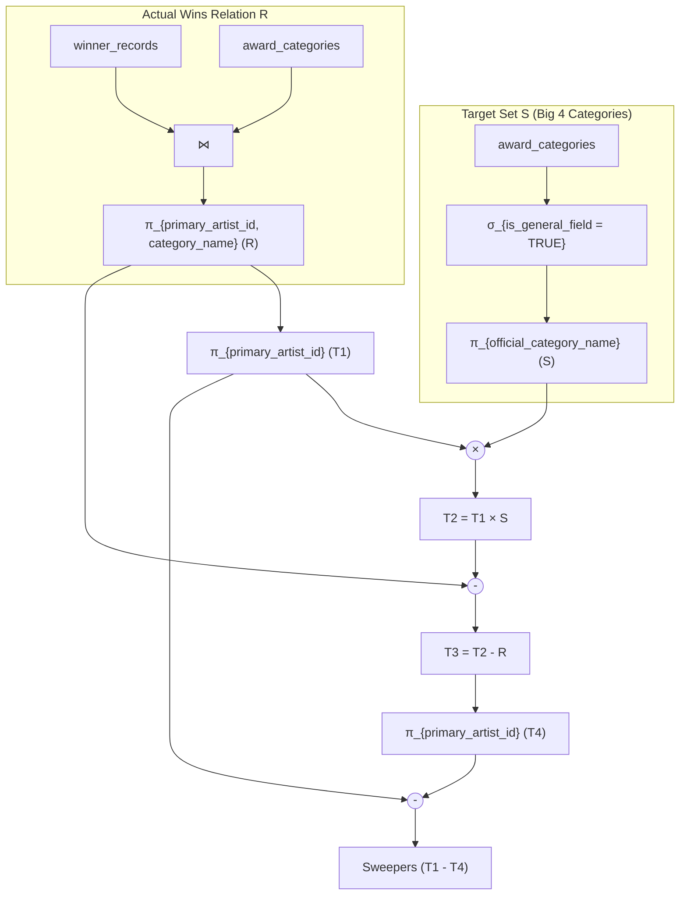

# Relational Algebra Query Specifications & Formal Examples

> **Course**: Advanced Database Management Systems (ADBMS)  
> **System**: GRAMMY Awards Information & Analytics System  
> **Phase**: Phase 7 — Relational Model  
> **Document**: Formal Mathematical Relational Algebra Expressions, SQL Translations, Intermediate Relations, and Query Execution Trees  
> **Status**: Completed  
> **Theoretical Framework**: Elmasri & Navathe (*Fundamentals of Database Systems*, 7th Edition, Chapter 8) / Codd's Relational Completeness (1972)  
> **Related Artifacts**:  
> - Relational Schema Catalog: [`relational-model/schema.md`](./schema.md)  
> - Keys & Referential Integrity: [`relational-model/keys-and-relationships.md`](./keys-and-relationships.md)  
> - Conceptual EER Model: [`docs/eer-design.md`](../docs/eer-design.md)  

---

## 1. Relational Algebra Theoretical Framework

**Relational Algebra** is a formal procedural query language consisting of a collection of mathematical operations that take one or two relations as input and produce a new relation as output. It serves as the formal theoretical foundation for relational database management systems and SQL query optimization engines.

### 1.1. Core Mathematical Operators
In accordance with E.F. Codd (1970, 1972) and Elmasri & Navathe (2016):

1. **Unary Operators**:
   - **Selection ($\sigma_p(R)$)**: Filters tuples from relation $R$ that satisfy predicate $p$.
     $$\sigma_p(R) = \{ t \mid t \in R \land p(t) = \text{TRUE} \}$$
   - **Projection ($\pi_{A_1, \dots, A_k}(R)$)**: Extracts specified columns $A_1, \dots, A_k$ and eliminates duplicate tuples.
     $$\pi_{A_1, \dots, A_k}(R) = \{ t[A_1, \dots, A_k] \mid t \in R \}$$
   - **Rename ($\rho_{S(B_1, \dots, B_n)}(R)$)**: Renames relation $R$ to $S$ and optionally renames its attributes to $B_1, \dots, B_n$.

2. **Binary Set-Theoretic Operators** (Require **Union Compatibility**: same degree and compatible domains):
   - **Union ($R \cup S$)**: All tuples appearing in $R$, $S$, or both.
     $$R \cup S = \{ t \mid t \in R \lor t \in S \}$$
   - **Set Difference ($R - S$)**: Tuples appearing in $R$ but not in $S$.
     $$R - S = \{ t \mid t \in R \land t \notin S \}$$
   - **Intersection ($R \cap S$)**: Tuples appearing in both $R$ and $S$ ($R \cap S \equiv R - (R - S)$).
     $$R \cap S = \{ t \mid t \in R \land t \in S \}$$
   - **Cartesian Product ($R \times S$)**: All combinations of tuples from $R$ and $S$ (does not require union compatibility).
     $$R \times S = \{ t_1 \circ t_2 \mid t_1 \in R \land t_2 \in S \}$$
     $$\text{Degree}(R \times S) = \text{Degree}(R) + \text{Degree}(S), \quad |R \times S| = |R| \cdot |S|$$

3. **Binary Relational Operators**:
   - **Theta Join ($R \bowtie_\theta S$)**: Cartesian product followed by selection on condition $\theta$.
     $$R \bowtie_\theta S = \sigma_\theta(R \times S)$$
   - **Equi-Join**: A theta join where condition $\theta$ consists solely of equality comparisons ($=$).
   - **Natural Join ($R \bowtie S$)**: Equi-join on all attributes having identical names in both relations, projecting out redundant duplicate join attributes.
   - **Division ($R \div S$)**: Produces tuples in $R$ that match with *all* tuples in $S$.
     $$R(X, Y) \div S(Y) = \pi_X(R) - \pi_X((\pi_X(R) \times S) - R)$$

4. **Outer Join Operators**:
   - **Left Outer Join ($R \leftouterjoin S$)**: Preserves all tuples from $R$, padding with NULLs when no matching tuple exists in $S$.
   - **Right Outer Join ($R \rightouterjoin S$)**: Preserves all tuples from $S$, padding with NULLs when no matching tuple exists in $R$.
   - **Full Outer Join ($R = \bowtie = S$)**: Preserves all tuples from both $R$ and $S$, padding missing values with NULLs.

---

## 2. Operation 1: Selection ($\sigma$)

### 2.1. Example 1.1: Simple Predicate Selection
**Business Scenario**: Retrieve all GRAMMY ceremonies staged in the modern era (Edition 60 or later, representing 2018–present).

#### Formal Relational Algebra Expression:
$$\text{ModernCeremonies} \leftarrow \sigma_{\text{edition\_number} \ge 60}(\text{ceremonies})$$

#### Intermediate Derivation:
1. Input relation: $\text{ceremonies}$ ($N \approx 67$ tuples).
2. Evaluation: For each tuple $t \in \text{ceremonies}$, test $t[\text{edition\_number}] \ge 60$.
3. Result relation: Sub-relation of identical degree ($\text{deg} = 11$) containing only matching tuples.

#### SQL Translation:
```sql
SELECT *
FROM ceremonies
WHERE edition_number >= 60;
```

---

### 2.2. Example 1.2: Complex Boolean Predicate Selection
**Business Scenario**: Identify eligible full-length album works in the database with a total runtime exceeding 40 minutes (2,400 seconds) released commercially after January 1, 2020.

#### Formal Relational Algebra Expression:
$$\text{LongAlbums} \leftarrow \sigma_{(\text{work\_type} = \text{'Album'}) \;\land\; (\text{duration\_total\_seconds} \ge 2400) \;\land\; (\text{commercial\_release\_date} \ge \text{'2020-01-01'})}(\text{nominated\_works})$$

#### SQL Translation:
```sql
SELECT *
FROM nominated_works
WHERE work_type = 'Album'
  AND duration_total_seconds >= 2400
  AND commercial_release_date >= '2020-01-01';
```

---

## 3. Operation 2: Projection ($\pi$)

### 3.1. Example 2.1: Column Dimensionality Reduction
**Business Scenario**: Extract the public identity catalog of all music creators, showing only their canonical identifier, stage name, primary musical genre, and country of citizenship.

#### Formal Relational Algebra Expression:
$$\text{CreatorDirectory} \leftarrow \pi_{\text{creator\_id}, \text{stage\_name}, \text{primary\_musical\_genre}, \text{country\_of\_citizenship}}(\text{creators})$$

#### Properties:
- Input relation degree: 11 attributes.
- Output relation degree: 4 attributes.
- Set semantics: Duplicate tuples are automatically eliminated.

#### SQL Translation:
```sql
SELECT DISTINCT creator_id, stage_name, primary_musical_genre, country_of_citizenship
FROM creators;
```

---

### 3.2. Example 2.2: Composition of Selection and Projection
**Business Scenario**: Retrieve the ceremony edition, broadcast year, and host city for all ceremonies broadcast exclusively on the CBS television network.

#### Formal Relational Algebra Expression:
$$\text{CBSCeremonies} \leftarrow \pi_{\text{edition\_number}, \text{broadcast\_year}, \text{host\_city}}(\sigma_{\text{primary\_network} = \text{'CBS'}}(\text{ceremonies}))$$

#### Relational Query Tree:


#### SQL Translation:
```sql
SELECT edition_number, broadcast_year, host_city
FROM ceremonies
WHERE primary_network = 'CBS';
```

---

## 4. Operation 3: Cartesian Product ($\times$)

### 4.1. Example 3.1: Complete Matrix of Eras and Award Fields
**Business Scenario**: Generate all theoretical combinations of historical eras and award fields to evaluate the structural evolution of genre coverage across Academy history.

#### Formal Relational Algebra Expression:
$$\text{EraFieldMatrix} \leftarrow \pi_{\text{era\_name}, \text{start\_calendar\_year}, \text{end\_calendar\_year}}(\text{timeline\_historical\_eras}) \times \pi_{\text{field\_name}, \text{field\_abbreviation}}(\text{award\_fields})$$

#### Mathematical Properties:
- Let $R = \pi(\text{timeline\_historical\_eras})$ with $|R| = 7$ eras and $\text{deg}(R) = 3$.
- Let $S = \pi(\text{award\_fields})$ with $|S| = 11$ fields and $\text{deg}(S) = 2$.
- The Cartesian product produces:
  $$|R \times S| = 7 \times 11 = 77 \text{ tuples}$$
  $$\text{deg}(R \times S) = 3 + 2 = 5 \text{ attributes}$$

#### Academic Explanation of Cartesian Product:
The unconstrained Cartesian product represents the theoretical space of all possible pairings between two independent relations. In relational engines, an unconstrained product is computationally expensive ($O(|R| \cdot |S|)$). However, it forms the formal foundational primitive from which all Join operations are derived:
$$R \bowtie_\theta S \equiv \sigma_\theta(R \times S)$$

#### SQL Translation:
```sql
SELECT E.era_name, E.start_calendar_year, E.end_calendar_year, F.field_name, F.field_abbreviation
FROM timeline_historical_eras E
CROSS JOIN award_fields F;
```

---

## 5. Operation 4: Join Operations ($\bowtie$)

### 5.1. Example 4.1: Natural Join ($\bowtie$)
**Business Scenario**: Retrieve ceremonies paired with their staging venue details where the join attribute is the shared primary key `venue_id`.

#### Formal Relational Algebra Expression:
$$\text{CeremonyVenues} \leftarrow \text{ceremonies} \bowtie \text{venues}$$

#### Equivalent Theta Join Expression:
$$\text{CeremonyVenues} \leftarrow \pi_{\dots}(\sigma_{\text{ceremonies.venue\_id} = \text{venues.venue\_id}}(\text{ceremonies} \times \text{venues}))$$

#### SQL Translation:
```sql
SELECT C.ceremony_id, C.edition_number, C.ceremony_date, C.host_city,
       V.venue_name, V.venue_type, V.max_seating_capacity
FROM ceremonies C
NATURAL JOIN venues V;
```

---

### 5.2. Example 4.2: Theta Join with Non-Equi Condition ($\bowtie_\theta$)
**Business Scenario**: Associate each ceremony with the historical era in which it took place, matching the ceremony's broadcast year against the era's calendar year boundaries.

#### Formal Relational Algebra Expression:
$$\text{CeremonyByEra} \leftarrow \text{ceremonies} \bowtie_{(\text{ceremonies.broadcast\_year} \ge \text{timeline\_historical\_eras.start\_calendar\_year} \;\land\; \text{ceremonies.broadcast\_year} \le \text{timeline\_historical\_eras.end\_calendar\_year})} \text{timeline\_historical\_eras}$$

#### Relational Query Tree:


#### SQL Translation:
```sql
SELECT C.edition_number, C.broadcast_year, E.era_name, E.dominant_audio_format, E.voting_tabulation_method
FROM ceremonies C
JOIN timeline_historical_eras E
  ON C.broadcast_year >= E.start_calendar_year
 AND C.broadcast_year <= E.end_calendar_year;
```

---

### 5.3. Example 4.3: Equi-Join across Three Relations
**Business Scenario**: List all winning works in the General Field (Big Four), displaying the category name, work title, primary artist name, and ceremony year.

#### Formal Relational Algebra Expression:
$$\text{BigFourWinners} \leftarrow \pi_{\text{official\_category\_name}, \text{work\_title}, \text{stage\_name}, \text{broadcast\_year}}($$
$$\sigma_{\text{is\_general\_field} = \text{TRUE}}(\text{award\_categories}) \bowtie_{\text{award\_categories.category\_id} = \text{winner\_records.category\_id}} \text{winner\_records}$$
$$\bowtie_{\text{winner\_records.winning\_work\_id} = \text{nominated\_works.work\_id}} \text{nominated\_works}$$
$$\bowtie_{\text{winner\_records.primary\_artist\_id} = \text{creators.creator\_id}} \text{creators}$$
$$\bowtie_{\text{winner\_records.ceremony\_id} = \text{ceremonies.ceremony\_id}} \text{ceremonies})$$

#### SQL Translation:
```sql
SELECT AC.official_category_name, NW.work_title, CR.stage_name, C.broadcast_year
FROM winner_records WR
JOIN award_categories AC ON WR.category_id = AC.category_id
JOIN nominated_works NW  ON WR.winning_work_id = NW.work_id
JOIN creators CR         ON WR.primary_artist_id = CR.creator_id
JOIN ceremonies C        ON WR.ceremony_id = C.ceremony_id
WHERE AC.is_general_field = TRUE;
```

---

### 5.4. Example 4.4: Left Outer Join ($\leftouterjoin$)
**Business Scenario**: List all nominated entries from the 65th Annual GRAMMY Awards, along with their winner record ID (if they won). Preserve nominations that did not win, displaying NULL for winner attributes.

#### Formal Relational Algebra Expression:
$$\text{NominationResults} \leftarrow \sigma_{\text{ceremony\_id} = \text{'CEREMONY\_065'}}(\text{nomination\_entries}) \leftouterjoin \text{winner\_records}$$

#### Academic Semantic Analysis:
- The Left Outer Join guarantees that every tuple from the left relation ($\text{nomination\_entries}$) appears in the result.
- If a nomination tuple $t_1$ has no matching tuple in $\text{winner\_records}$, the attributes of $\text{winner\_records}$ are filled with $\text{NULL}$.
- This operation formally distinguishes between nominees ($N \approx 5$ to $10$ per category) and the elevated winner ($1$ per category).

#### SQL Translation:
```sql
SELECT NE.nomination_id, NE.entry_billing_title, NE.ballot_slot_order,
       WR.winner_record_id, WR.trophy_statuettes_awarded_count
FROM nomination_entries NE
LEFT OUTER JOIN winner_records WR
  ON NE.nomination_id = WR.nomination_id
WHERE NE.ceremony_id = 'CEREMONY_065';
```

---

## 6. Operation 5: Union ($\cup$)

### 6.1. Example 5.1: Union of Heterogeneous Creative Entities (Union Type)
**Business Scenario**: Construct a unified directory of all recognized musical performing entities (both individual solo artists and collective musical ensembles) eligible to receive awards.

#### Union Compatibility Check:
- Relation 1 ($\text{SoloArtists}$):
  $$R_1 \leftarrow \pi_{\text{creator\_id}, \text{stage\_name}, \text{country\_of\_citizenship}}(\sigma_{\text{is\_group\_ensemble\_flag} = \text{FALSE}}(\text{creators}))$$
  Degree = 3, Domains = $\langle \text{VARCHAR(32)}, \text{VARCHAR(128)}, \text{VARCHAR(64)} \rangle$.
- Relation 2 ($\text{BandEnsembles}$):
  $$R_2 \leftarrow \pi_{\text{group\_id}, \text{group\_name}, \text{origin\_country}}(\text{musical\_groups})$$
  Degree = 3, Domains = $\langle \text{VARCHAR(32)}, \text{VARCHAR(128)}, \text{CHAR(2)} \rightarrow \text{VARCHAR(64)} \rangle$.
- Attributes are union compatible.

#### Formal Relational Algebra Expression:
$$\text{AllPerformingEntities} \leftarrow \rho_{(\text{entity\_id}, \text{billing\_name}, \text{country})}(R_1) \;\cup\; \rho_{(\text{entity\_id}, \text{billing\_name}, \text{country})}(R_2)$$

#### Relational Query Tree:


#### SQL Translation:
```sql
SELECT creator_id AS entity_id, stage_name AS billing_name, country_of_citizenship AS country
FROM creators
WHERE is_group_ensemble_flag = FALSE
UNION
SELECT group_id AS entity_id, group_name AS billing_name, origin_country AS country
FROM musical_groups;
```

---

## 7. Operation 6: Set Difference ($-$)

### 7.1. Example 6.1: Identifying Non-Winning Nominations
**Business Scenario**: Find all nomination IDs for entries that were nominated but did **not** win an award.

#### Formal Relational Algebra Expression:
$$\text{NonWinningNominations} \leftarrow \pi_{\text{nomination\_id}}(\text{nomination\_entries}) - \pi_{\text{nomination\_id}}(\text{winner\_records})$$

#### Mathematical Proof of Correctness:
1. Let $U = \pi_{\text{nomination\_id}}(\text{nomination\_entries})$.
2. Let $W = \pi_{\text{nomination\_id}}(\text{winner\_records})$.
3. By referential integrity:
   $$W \subseteq U$$
4. The set difference produces:
   $$U - W = \{ x \mid x \in U \land x \notin W \}$$
   which is the exact set of nomination entries that were never elevated to a victory.

#### SQL Translation:
```sql
SELECT nomination_id FROM nomination_entries
EXCEPT
SELECT nomination_id FROM winner_records;
```
*(Or via Anti-Join)*:
```sql
SELECT NE.nomination_id
FROM nomination_entries NE
WHERE NOT EXISTS (
    SELECT 1 FROM winner_records WR WHERE WR.nomination_id = NE.nomination_id
);
```

---

### 7.2. Example 6.2: Creators Nominated but Never Awarded a GRAMMY
**Business Scenario**: Identify music creators who have received at least one official nomination in Academy history but have **never** won a GRAMMY Award.

#### Formal Relational Algebra Expression:
$$\text{NominatedCreators} \leftarrow \pi_{\text{primary\_artist\_id}}(\text{nomination\_entries})$$
$$\text{WinningCreators} \leftarrow \pi_{\text{primary\_artist\_id}}(\text{winner\_records})$$
$$\text{NominatedNeverWon} \leftarrow \text{NominatedCreators} - \text{WinningCreators}$$
$$\text{Result} \leftarrow \pi_{\text{creator\_id}, \text{stage\_name}}(\text{creators} \bowtie_{\text{creator\_id} = \text{primary\_artist\_id}} \text{NominatedNeverWon})$$

#### SQL Translation:
```sql
SELECT C.creator_id, C.stage_name
FROM creators C
WHERE C.creator_id IN (
    SELECT primary_artist_id FROM nomination_entries
    EXCEPT
    SELECT primary_artist_id FROM winner_records
);
```

---

## 8. Operation 7: Relational Division ($\div$) (Advanced Query)

### 8.1. Problem Formulation: The "Big Four Sweep" Completeness Query
**Academic Problem Statement**:
Find the identifiers and stage names of all music creators who have won awards in **all four** General Field categories:
$$\text{BigFour} = \{\text{'Album of the Year'}, \text{'Record of the Year'}, \text{'Song of the Year'}, \text{'Best New Artist'}\}$$

This is the classic relational database division query ("Find $X$ that are associated with *all* $Y$ in relation $S$").

---

### 8.2. Formal Relational Algebra Specification

Let relation $R(\text{creator\_id}, \text{category\_name})$ represent all creator-category win pairs:
$$R \leftarrow \pi_{\text{primary\_artist\_id}, \text{official\_category\_name}}(\text{winner\_records} \bowtie \text{award\_categories})$$

Let relation $S(\text{category\_name})$ represent the set of Big Four category names:
$$S \leftarrow \pi_{\text{official\_category\_name}}(\sigma_{\text{is\_general\_field} = \text{TRUE} \;\land\; \text{official\_category\_name} \in \{\dots\}}(\text{award\_categories}))$$

The division operation is defined as:
$$\text{Sweepers} \leftarrow R \div S$$

---

### 8.3. Step-by-Step Derivation Using Fundamental Primitive Operators

Because division is a derived operator, it can be expressed strictly using Projection ($\pi$), Cartesian Product ($\times$), and Set Difference ($-$):

#### Step 1: Project All Candidates ($X$)
Extract all creators who have won at least one award:
$$T_1 \leftarrow \pi_{\text{primary\_artist\_id}}(R)$$

#### Step 2: Form Theoretical Cartesian Product of All Possibilities
Construct every possible combination of winning creators paired with all four Big Four categories:
$$T_2 \leftarrow T_1 \times S$$
($T_2$ represents the hypothetical state where every creator won all 4 categories).

#### Step 3: Find Disqualifications (Unachieved Wins)
Subtract the actual win relation $R$ from the theoretical Cartesian product $T_2$:
$$T_3 \leftarrow T_2 - R$$
($T_3$ contains tuple $\langle c, cat \rangle$ if creator $c$ **did not** win category $cat$).

#### Step 4: Extract Disqualified Creators
Project the creator IDs that missed at least one Big Four category:
$$T_4 \leftarrow \pi_{\text{primary\_artist\_id}}(T_3)$$

#### Step 5: Subtract Disqualified Creators from All Candidates
Subtract the disqualified creators from the total pool of candidate creators:
$$\text{DivisionResult} \leftarrow T_1 - T_4$$

#### Complete Expanded Expression:
$$\text{Sweepers} \leftarrow \pi_{\text{creator\_id}}(R) - \pi_{\text{creator\_id}}((\pi_{\text{creator\_id}}(R) \times S) - R)$$

---

### 8.4. Relational Query Tree for Division


---

### 8.5. SQL Translation of Relational Division

In SQL, relational division is expressed using double-negation (`NOT EXISTS ... NOT EXISTS`) or correlated aggregation (`HAVING COUNT(DISTINCT ...) = |S|`):

#### Formulation 1: Canonical Double-Negation (Corresponds to $T_1 - \pi(T_2 - R)$)
```sql
SELECT C.creator_id, C.stage_name
FROM creators C
WHERE NOT EXISTS (
    -- Categories in Big Four that the creator did NOT win:
    SELECT S.category_id
    FROM award_categories S
    WHERE S.official_category_name IN (
        'Album of the Year',
        'Record of the Year',
        'Song of the Year',
        'Best New Artist'
    )
    AND NOT EXISTS (
        -- Check if creator won this category:
        SELECT 1
        FROM winner_records WR
        WHERE WR.primary_artist_id = C.creator_id
          AND WR.category_id = S.category_id
    )
);
```

#### Formulation 2: Relational Group Aggregation Equivalent
```sql
SELECT CR.creator_id, CR.stage_name
FROM winner_records WR
JOIN award_categories AC ON WR.category_id = AC.category_id
JOIN creators CR ON WR.primary_artist_id = CR.creator_id
WHERE AC.official_category_name IN (
    'Album of the Year',
    'Record of the Year',
    'Song of the Year',
    'Best New Artist'
)
GROUP BY CR.creator_id, CR.stage_name
HAVING COUNT(DISTINCT AC.official_category_name) = 4;
```

---

## 9. Relational Algebra Query Verification Summary

```
┌──────────────────────────────────────────────────────────────────────────────────────────────────┐
│                            RELATIONAL ALGEBRA COVERAGE VERIFICATION                              │
├──────┬──────────────────────┬───────────────────────┬────────────────────────────────────────────┤
│ Item │ Operation            │ Mathematical Symbol   │ Demonstrated Domain Scenario               │
├──────┼──────────────────────┼───────────────────────┼────────────────────────────────────────────┤
│ 1    │ Selection            │ σ                     │ Modern ceremonies (edition ≥ 60)           │
│      │                      │                       │ Full-length albums > 40 min released ≥ 2020│
├──────┼──────────────────────┼───────────────────────┼────────────────────────────────────────────┤
│ 2    │ Projection           │ π                     │ Dimensionality reduction on creators       │
│      │                      │                       │ Composed selection & projection on CBS     │
├──────┼──────────────────────┼───────────────────────┼────────────────────────────────────────────┤
│ 3    │ Cartesian Product    │ ×                     │ Era-to-Field theoretical matrix            │
├──────┼──────────────────────┼───────────────────────┼────────────────────────────────────────────┤
│ 4    │ Natural Join         │ ⋈                     │ Ceremony staged at Venue (PK=FK)           │
│      │ Theta Join           │ ⋈_θ                   │ Ceremony temporally bounded by Era dates   │
│      │ Equi-Join            │ ⋈_{A=B}               │ Multi-way join for Big Four winners        │
│      │ Left Outer Join      │ ⟕                     │ All nominations preserved with win status  │
├──────┼──────────────────────┼───────────────────────┼────────────────────────────────────────────┤
│ 5    │ Union                │ ∪                     │ Solo artists ∪ Musical ensembles           │
├──────┼──────────────────────┼───────────────────────┼────────────────────────────────────────────┤
│ 6    │ Set Difference       │ −                     │ Nominations that lost (NE − WR)            │
│      │                      │                       │ Nominated creators who never won           │
├──────┼──────────────────────┼───────────────────────┼────────────────────────────────────────────┤
│ 7    │ Relational Division  │ ÷                     │ Creators winning ALL Big Four categories   │
│      │                      │                       │ (Expanded via π, ×, − primitives)          │
└──────┴──────────────────────┴───────────────────────┴────────────────────────────────────────────┘
```
